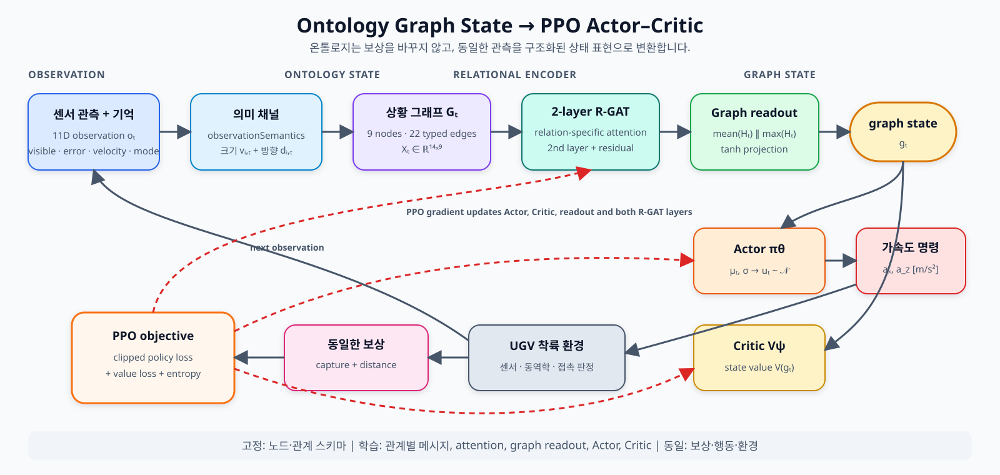
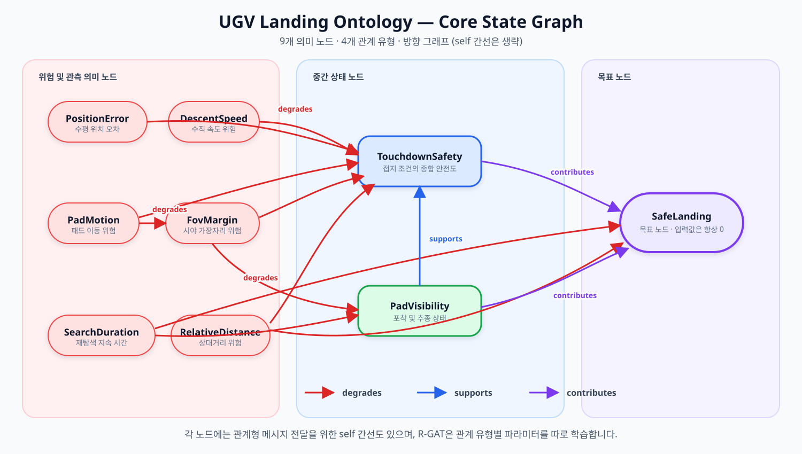

# UGV Landing 2D — Ontology Graph PPO

이동 중인 UGV의 착륙 패드를 드론이 추종하면서 **시야 이탈 → 상승 탐색 → 재포착 → 착륙**을 수행하는 2차원 MATLAB 시뮬레이션입니다. 동일한 환경과 보상에서 상태 표현만 바꿔 기준 PPO와 온톨로지 그래프 기반 PPO를 비교합니다.

## 비교 모델

| 모델 | 정책 입력 | 특징 |
| --- | --- | --- |
| PN guidance | 상대 위치·속도 | 비례 항법 기반 기준선 |
| PPO baseline | 11차원 관측 벡터 | PN 교사 모방 후 PPO 미세조정 가능 |
| Ontology graph PPO | 상황 그래프 `G_t=(V_t,E_t,X_t)` | R-GAT 부호화와 그래프 수준 readout 사용 |

두 PPO 모델은 보상 함수, 행동 공간, 환경 동역학, 종료 조건과 PPO 구현을 공유합니다. `landing2d.graphstate.assertSameProblem`이 실행 중 이 조건을 검사합니다.

## 온톨로지는 강화학습에 어떻게 사용되는가

현재 제안 모델에서 온톨로지는 **보상 가중치를 만들거나 보상을 성형하지 않습니다.** 기준 모델과 같은 관측 정보로 상황 그래프를 만들고, R-GAT으로 부호화한 그래프 수준 벡터를 PPO Actor와 Critic의 입력으로 사용합니다. 즉 실험에서 바뀌는 핵심은 `상태 표현`입니다.

### 전체 처리 흐름



고정된 노드 집합과 관계 집합은 온톨로지 지식이고, 시간에 따라 바뀌는 것은 노드 특징 행렬 `X_t`입니다.

$$
G_t=(V,E,X_t),\qquad |V|=9,\qquad E=\{(i,r,j)\}
$$

### 온톨로지 관계 구조

아래 그림은 가독성을 위해 모든 노드에 존재하는 `self` 간선은 생략했습니다.



- 위험 노드: `PositionError`, `DescentSpeed`, `PadMotion`, `FovMargin`, `SearchDuration`, `RelativeDistance`
- 상태/결과 노드: `PadVisibility`, `TouchdownSafety`, `SafeLanding`
- 관계 유형: `degrades`, `supports`, `contributes`, `self`
- `SafeLanding`은 정책에 정답을 제공하지 않도록 상태 입력에서 항상 0인 목표 노드입니다.

### 1. 관측을 노드 특징으로 변환

노드 $i$의 의미 값 $v_{i,t}$, 위험 노드 여부 $q_i$, 방향 부호 $d_{i,t}$와 노드 정체성 one-hot 벡터 $e_i$를 결합합니다.

$$
x_{i,t}=
\begin{bmatrix}
v_{i,t} \\
1-v_{i,t} \\
q_i \\
1 \\
d_{i,t} \\
e_i
\end{bmatrix},
\qquad
X_t=[x_{1,t},\ldots,x_{N,t}]\in\mathbb{R}^{(5+N)\times N}
$$

현재 $N=9$이므로 각 노드 특징은 14차원입니다. $v_{i,t}$는 위험 또는 안전의 크기이고, $d_{i,t}\in[-1,1]$는 절댓값 기반 의미 값에서 사라지는 좌·우 및 상승·하강 방향을 복원합니다. 모든 값은 기준 11차원 관측이 접근할 수 있는 정보만 사용합니다.

### 2. 관계형 그래프 어텐션

관계 $r$마다 투영 행렬 $W_r$, 관계 임베딩 $e_r$와 어텐션 파라미터 $a_r$를 별도로 학습합니다. 간선 $(i,r,j)$의 점수와 도착 노드 $j$ 기준 어텐션은 다음과 같습니다.

$$
s_{ij}^{(r)}=
\operatorname{LeakyReLU}\!\left(
a_r^\top
\left[W_rh_i\,\Vert\,W_rh_j\,\Vert\,e_r\right]
\right)
$$

$$
\alpha_{ij}^{(r)}=
\frac{\exp(s_{ij}^{(r)})}
{\sum_{(k,q,j)\in E}\exp(s_{kj}^{(q)})},
\qquad
h'_j=\sum_{(i,r,j)\in E}\alpha_{ij}^{(r)}W_rh_i
$$

두 번째 R-GAT 계층에는 잔차 연결을 사용합니다.

$$
H_t^{(1)}=\tanh(\operatorname{RGAT}_1(X_t)),
\qquad
H_t=\tanh(\operatorname{RGAT}_2(H_t^{(1)})+H_t^{(1)})
$$

관계 유형을 분리하므로 같은 두 노드가 연결되어도 `degrades`와 `supports`는 서로 다른 메시지와 주의 가중치를 학습합니다.

### 3. 그래프 전체를 PPO 상태로 읽기

특정 목표 노드 하나만 선택하지 않고 모든 노드 임베딩의 평균과 최댓값을 함께 사용합니다.

$$
\bar h_t=\frac{1}{N}\sum_{i=1}^{N}H_{t,:,i},
\qquad
h_t^{\max}=\max_{i=1,\ldots,N}H_{t,:,i}
$$

$$
g_t=\tanh\!\left(W_g[\bar h_t\,\Vert\,h_t^{\max}]+b_g\right)
$$

평균 readout은 전체 상황을, max readout은 특정 위험 노드의 강한 반응을 보존합니다.

### 4. Actor–Critic과 공동 학습

Actor와 Critic은 같은 $G_t$를 받지만 각각 독립된 R-GAT 부호기를 가집니다.

$$
\mu_t=f_\theta(g_t^{\pi}),
\qquad
u_t\sim\mathcal{N}(\mu_t,\operatorname{diag}(\sigma^2)),
\qquad
V_t=f_\psi(g_t^V)
$$

PPO 정책 목적함수는 기준 모델과 같습니다.

$$
L_{\mathrm{clip}}(\theta)=
\mathbb{E}_t\!\left[
\min\left(
r_t(\theta)\hat A_t,
\operatorname{clip}(r_t(\theta),1-\epsilon,1+\epsilon)\hat A_t
\right)
\right]
$$

$$
r_t(\theta)=
\frac{\pi_\theta(u_t\mid G_t)}
{\pi_{\theta_{\mathrm{old}}}(u_t\mid G_t)}
$$

Actor 손실과 Critic 가치 손실의 기울기는 그래프 readout과 두 R-GAT 계층까지 끝까지 역전파됩니다. 따라서 온톨로지 구조는 고정되어 있지만, 관계별 메시지 전달과 그래프 표현은 착륙 보상을 최대화하도록 PPO와 함께 학습됩니다.

> 요약: `관측 → 의미 노드 → 관계형 메시지 전달 → 그래프 상태 g_t → PPO 행동`. 현재 모델에서 온톨로지는 보상을 변경하지 않고, 에이전트가 같은 관측을 구조적으로 해석하는 방식을 변경합니다.

## 주요 기능

- 수평·수직 가속도 명령을 사용하는 UGV 착륙 시뮬레이션
- Toolbox와 Simulink에 의존하지 않는 PPO 및 R-GAT 구현
- 교사 모방 학습 또는 무작위 초기 정책에서의 학습
- 학습 점수·착륙률·포착률을 표시하는 실시간 대시보드
- 온톨로지 그래프 노드 평균과 분산 시각화
- 공통 초기조건 표본을 이용한 몬테카를로 평가
- 평균 x-z 궤적과 시간별 1σ 위치 공분산 타원
- 설정 지문 기반 정책 재사용과 MATLAB 회귀 테스트

## 빠른 시작

저장소를 받은 뒤 MATLAB의 Current Folder를 내부 프로젝트 폴더로 지정합니다.

```matlab
cd ugv_landing_2d_workspace
run_all     % PN, baseline PPO, ontology graph PPO 통합 비교
run_demo    % PN guidance 실시간 시뮬레이션
```

저장된 정책의 설정 지문이 현재 설정과 같으면 다시 학습하지 않고 재사용합니다.

```matlab
run_all(struct('rlRetrain',true));            % 정책을 처음부터 다시 학습
run_all(struct('evaluationMonteCarloRuns',50)); % 몬테카를로 평가 50회
run_all(struct('showLiveDashboard',false));   % 실시간 대시보드 비활성화
run_all(struct('figureVisible',false));       % GUI 없이 계산과 저장만 수행
run_all(struct('scratchBaseline',true));      % 두 PPO 모델 모두 교사 없이 학습
```

> 기본 몬테카를로 평가는 비교군마다 20회 수행하며, 모든 비교군이 같은 시드와 초기조건 표본을 사용합니다.

## 시각화

통합 대시보드는 다음 정보를 한 화면에 표시합니다.

- PPO 평가 점수와 평균 학습 return
- 착륙률과 패드 포착률
- 온톨로지/R-GAT 학습 상태와 그래프 노드 통계
- 비교군별 몬테카를로 평균 이동 궤적 및 1σ 공분산


## 프로젝트 구조

```text
ugv_landing_2d_workspace/
├─ run_all.m                  통합 학습·평가·비교 진입점
├─ run_demo.m                 PN guidance 데모
├─ run_tests.m                전체 회귀 테스트
├─ src/+landing2d/
│  ├─ +control/               PN 및 PD 제어
│  ├─ +dynamics/              드론 동역학
│  ├─ +rl/                    PPO, 모방 학습, 몬테카를로 평가
│  ├─ +ontology/              온톨로지 스키마와 보상 설계
│  ├─ +graphstate/            상황 그래프와 R-GAT 상태 부호기
│  ├─ +rgat/                  관계형 그래프 어텐션 연산
│  └─ +viz/                   대시보드와 결과 시각화
├─ tests/                     수치·그래프·시각화 테스트
├─ docs/                      설계 및 검증 문서
└─ results/                   정책, 로그, 표와 그림
```

## 테스트

```matlab
run_tests(false)  % GUI를 제외한 수치·학습·온톨로지 테스트
run_tests(true)   % 그래픽과 저장 검증을 포함한 전체 테스트
```

## 문서

- [상세 한국어 README](ugv_landing_2d_workspace/README_KO.md)
- [모듈 구성과 실행 흐름](ugv_landing_2d_workspace/docs/MODULE_MAP_KO.md)
- [온톨로지 그래프 상태 표현](ugv_landing_2d_workspace/docs/ONTOLOGY_GRAPH_STATE_KO.md)
- [온톨로지/R-GAT 설계](ugv_landing_2d_workspace/docs/ONTOLOGY_RGAT_KO.md)
- [검증 결과](ugv_landing_2d_workspace/docs/VALIDATION_KO.md)

모든 제어기의 출력 단위는 수평·수직 가속도 `[m/s²]`입니다.
