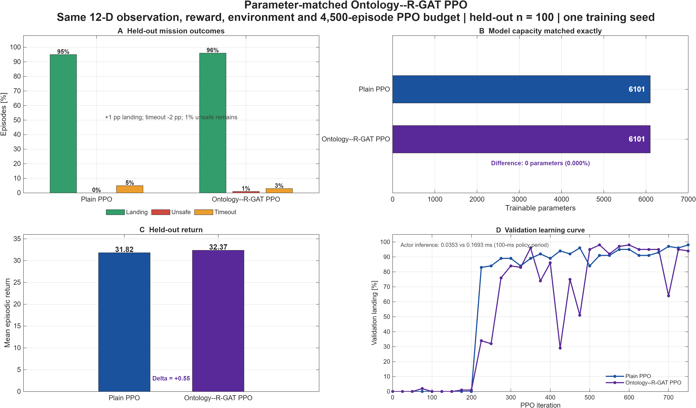

# Causal Ontology R-GAT PPO for Moving-Platform Landing



## 최종 결과

| 지표 | 일반 PPO | 온톨로지–R-GAT PPO | 결과 |
|---|---:|---:|---:|
| Held-out 착륙률 | 95% | **96%** | **+1%p** |
| Unsafe 종료율 | **0%** | 1% | +1%p |
| Timeout | 5% | **3%** | **−2%p** |
| 평균 return | 31.819 | **32.372** | **+0.553** |
| 공칭 `C_valid` | 77.329% | **80.799%** | **+3.470%p** |
| 공칭 `D_obs` P95 | **0.074238** | 0.095983 | +29.3% |
| Pooled `J_policy` | **4.0996** | 6.6914 | +63.2% |
| 파라미터 | 6,101 | 6,101 | **동일** |
| Actor 추론 | **0.0353 ms** | 0.1693 ms | 100 ms 주기의 0.169% |

> **결론:** 정확히 동일한 모델 용량에서 온톨로지–R-GAT의 held-out 착륙률·평균 return·`C_valid` 개선. 저랭크 관계 readout으로 종전 압축 모델보다 `D_obs`와 `J_policy`도 개선했으나 일반 PPO에는 아직 미달. 단일 학습 seed와 위험 실패 1%를 함께 공개하며 안전성·통계적 우월성 주장은 제외.

동일한 센서·12차원 관측·보상·행동·종료 조건에서 일반 PPO와 graph-only 온톨로지–R-GAT PPO를 비교하는 2차원 이동 UGV 착륙 연구 코드.

결과 재생성:

```matlab
run(struct('latestOntology',true))
```

## 연구 질문

> 동일한 최소 센서 정보와 공통 보상 조건에서, 물리 의미를 가진 typed ontology와 R-GAT 상태 표현이 일반 MLP PPO보다 일관된 착륙 정책을 생성하는가?

공식 비교:

| 방법 | Actor/Critic 입력 | 비고 |
|---|---|---|
| 일반 PPO | 12차원 공통 관측 $o_t$ | MLP |
| 온톨로지–R-GAT PPO | 동일 $o_t$에서 생성한 7노드 typed graph | graph-only R-GAT + MLP |

비교군 공통 요소:

- 환경 및 드론·UGV 동역학
- 마커 카메라, PnP–KF, 융합 측위
- 12차원 정책 가용 정보
- `reward_v5`
- 가속도 행동 `[a_x,a_z]`
- 접촉·종료·안전 판정
- PPO 하이퍼파라미터와 4,500 episode 예산
- 학습 시드별 환경 episode 순서

제안 모델 제외 요소:

- raw 관측과 graph의 동시 입력
- 행동 residual 또는 의미 gate
- 추론 guard 및 validation guard
- 정책 명령을 재작성하는 보조 제어기
- 관계 셔플 모델을 이용한 공식 성능 비교

`shuffled_rgat_ppo`는 관계 절제 실험 코드로만 유지되며 공식 학습·평가·그림에서 제외.

## 시스템 조건

| 항목 | 값 |
|---|---:|
| 공간 | 2차원 $x$–$z$ |
| 물리 적분 / 정책 주기 | 0.01 s / 0.10 s |
| 임무 시간 | 최대 70 s |
| 초기 상대 고도 | 4–8 m |
| UGV 초기 속도 | 0.5–2.5 m/s |
| UGV 가속도 | 0.3–1.5 m/s² |
| 카메라 | 전방 하향 30°, FOV 63.9503° |
| 행동 한계 | $|a_x|\le2.5$, $|a_z|\le2.0$ m/s² |
| 착륙 위치/속도 한계 | 0.5 m, 0.35/0.30 m/s |
| 착륙 자세/각속도 한계 | 5°, 10°/s |

드론 평면 동역학:

$$
\ddot\theta=\omega_n^2(\theta^{sp}-\theta)-2\zeta\omega_n\dot\theta,
\qquad
\dot T=\frac{T^{sp}-T}{\tau_T},
$$

$$
a_x=\frac{T\sin\theta}{m},\qquad
a_z=\frac{T\cos\theta}{m}-g.
$$

## 최소 공통 관측

$$
o_t=[o_t^{relative};o_t^{motion};o_t^{quality}]\in\mathbb R^{12}.
$$

| 그룹 | 필드 |
|---|---|
| 상대 상태 | `relative_x`, `relative_height`, `relative_vx` |
| 운동 | `ugv_vx`, `drone_vz`, `drone_sinTheta`, `drone_cosTheta`, `drone_pitchRate` |
| 품질 | `ugv_visionUpdated`, `ugv_visionAge`, `drone_navigationValid`, `drone_navigationAge` |

정규화:

$$
\mathcal S(q;s)=\frac{q}{|q|+s},\qquad
\mathcal A(\tau;s)=\frac{\max(\tau,0)}{\max(\tau,0)+s}.
$$

- PnP–KF UGV 위치·속도 추정과 드론 융합 측위만 사용
- 절대 수평 위치·tracker 판단·감독기 문맥·보상·성공 라벨 제외
- 일반 PPO와 제안 모델의 정보량 동일

## 온톨로지 및 R-GAT

카메라 정렬 다양체:

$$
k_c=\tan30^\circ,\qquad
c_x=\bar e_x-k_c\bar h,\qquad
c_v=\bar v_r-k_c\bar v_z.
$$

노드:

1. `RelativePosition`
2. `RelativeVelocity`
3. `PadVelocity`
4. `VerticalMotion`
5. `Attitude`
6. `VisionQuality`
7. `NavigationQuality`

관계 유형:

- `informs`: 운동 상태의 인과 정보 전달
- `conditions`: 센서 품질에 따른 상태 신뢰도 조건화
- `couples`: 카메라 기하와 기체 운동의 결합
- `self`: 노드 자기정보 보존

그래프 규모: 7노드, 4관계, 의미 간선 9개, 자기 간선 7개, 총 16간선.

관계 attention:

$$
\ell_{ji}^{(r)}=\operatorname{LReLU}_{0.2}
\left(a_r^\top[W_rx_j\Vert W_rx_i\Vert e_r]\right),
$$

$$
\alpha_{ji}^{(r)}=
\frac{\exp\ell_{ji}^{(r)}}
{\sum_{(k\to i,r')}\exp\ell_{ki}^{(r')}+10^{-9}},
$$

$$
h_i=\tanh\left(W_0x_i+b_0+
\sum_{(j\to i,r)}\alpha_{ji}^{(r)}W_rx_j\right).
$$

Identity-preserving grouped readout:

$$
g_t=\tanh\left(W_g[h_1\Vert\cdots\Vert h_7]+b_g\right)
\in\mathbb R^{5},\qquad [h_1\Vert\cdots\Vert h_7]\in\mathbb R^{28}.
$$

| 망 | 일반 PPO | 온톨로지–R-GAT PPO |
|---|---|---|
| Actor | 12–48–48–2 | R-GAT–5–48–48–2 |
| Critic | 12–48–48–1 | R-GAT–5–48–48–1 |
| R-GAT 은닉/관계 폭 | 없음 | 4/4 |

## 학습

| 항목 | 값 |
|---|---:|
| PPO 반복 × episode | 750 × 6 = 4,500 |
| PPO epoch / mini-batch | 8 / 256 |
| Actor / Critic / R-GAT 학습률 | $2\times10^{-4}$ / $5\times10^{-4}$ / $10^{-4}$ |
| clip ratio / GAE $\lambda$ | 0.2 / 0.95 |
| entropy / gradient norm | 0.004 / 1.0 |
| 평가 간격 | 25 PPO 반복 |

- 무작위 초기화 직접 PPO
- 그래프 사전학습 없음
- 동일 성능 커리큘럼 및 episode 난수열
- validation 100회 기반 checkpoint 선택
- held-out test seed를 이용한 선택 금지

## 최종 결과

### Held-out 임무 100회

| 방법 | 착륙 | unsafe | timeout | 평균 return |
|---|---:|---:|---:|---:|
| 일반 PPO | 95% | **0%** | 5% | 31.819 |
| 온톨로지–R-GAT PPO | **96%** | 1% | **3%** | **32.372** |

### 고정 probe 지표

6,101개 완전 정합 체크포인트로 독립 재평가한 결과:

| 잡음 배율 | 방법 | `C_valid` | `D_obs` P95 |
|---:|---|---:|---:|
| 0.5 | PPO / R-GAT | 77.735 / **81.821** | **0.038167** / 0.046716 |
| 1.0 | PPO / R-GAT | 77.329 / **80.799** | **0.074238** / 0.095983 |
| 2.0 | PPO / R-GAT | 74.895 / **76.812** | **0.13726** / 0.18060 |

- 공칭 `C_valid`: 77.329% → 80.799%, **+3.470%p**
- 공칭 `D_obs` P95: 0.074238 → 0.095983, +29.3%
- pooled `J_policy`: 4.0996 → 6.6914, +63.2%
- 종전 6,095개 모델 대비: `C_valid` +16.617%p, `D_obs` P95 −5.5%, `J_policy` −11.4%
- 판정: 유효행동 일관성 우위 회복, 잡음 민감도·평활성 격차 축소. 후자의 PPO 대비 열세는 잔존

### 계산 비용

| 방법 | 파라미터 | Actor 추론 | PPO 학습 시간 |
|---|---:|---:|---:|
| 일반 PPO | 6,101 | 0.0353 ms | 859.3 s |
| 온톨로지–R-GAT PPO | 6,101 | 0.1693 ms | 1,465.6 s |

- 제안 모델 추론 시간: 100 ms 정책 결정 주기의 약 0.18%
- 그래프 구성·관계별 연산으로 인한 MATLAB 추론 오버헤드와 위험 실패 1% 동시 공개

## 기존 vision-based DRL 파이프라인 대비 의미

Shin et al., *Vision-Based Autonomous Drone Landing on Moving Platforms With Uncertain Motion via Deep Reinforcement Learning*의 keypoint–LSTM–active-perception 파이프라인 대비 현재 결과의 위치.

| 기존 파이프라인의 문제 | 현재 접근 | 판정 |
|---|---|---|
| estimator 오차를 다음 시점 reward에 결합 | 센서 품질을 ontology 관계로 처리, reward 공통화 | 구조적 개선 가능성 |
| 256차원 비구조 latent와 512차원 LSTM state | 7개 물리 의미 노드 | 해석성 개선 |
| true relative state 기반 privileged critic | Actor/Critic 모두 동일 인과 관측 | 학습–배포 정보 경계 일치 |
| 성공률·RMSE·FOV heatmap 중심 평가 | `C_valid`, `D_obs`, `J_policy` | 정책 일관성 평가 공백 보완 |
| 접촉 중심 성공 정의 | 속도·자세·각속도 접촉 한계 | touchdown quality 강화 |
| binary visibility reward의 진동 | 카메라 정렬 다양체 + 관계형 상태 | 정합 모델 pooled jerk 증가, 미해결 |
| 형식적 안전 보장 부재 | 독립 물리 유효성 판정 | 평가 보완, 보장 미해결 |

현재 결과로 해결하지 못한 범위:

- 장시간 완전 비가시 중 급가속 플랫폼 상태 추정
- 3차원 yaw·원운동·zig-zag·U-turn·heave
- 최대 8 m/s 플랫폼과 실제 3–4 m/s 비행
- 초기 FOV 밖 표적 획득
- 제어 장벽함수 수준의 형식적 안전 보장
- 다중 학습 시드 통계

따라서 현재 주장은 “기존 영상 DRL을 전면 대체”가 아니라 다음 범위.

> 동일 최소 센서 정보와 공통 보상에서 typed ontology–R-GAT 상태 표현이 착륙률을 유지하면서 일반 PPO보다 물리적으로 일관되고 잡음에 덜 민감한 행동을 생성한다는 실험적 근거.

## 실행

전체 실행:

```matlab
run
```

빠른 검사:

```matlab
run(struct('executionMode','smoke','generatePaper',false, ...
    'figureVisible',false,'saveResults',false, ...
    'showLiveDashboard',false))
```

최종 그림과 CSV 재생성:

```matlab
run(struct('latestOntology',true))
```

단일 시나리오 및 실시간 비교:

```matlab
run_scenario('S3')
run_live('S3')
```

## 문서 및 산출물

- [최종 설계·수식·실험 분석](docs/refactor/CONSISTENCY_RUNTIME_REVIEW.md)
- [보상 함수 이론](docs/refactor/REWARD_RATIONALE.md)
- [공통 관측 계약](docs/COMMON_OBSERVATION_KO.md)
- [PPT용 최종 그림 코드](src/orchestration/+landing2d/+viz/plotParameterMatchedEvidence.m)
- [PPT 수정 에이전트 프롬프트](docs/refactor/PPT_AGENT_PROMPT_KO.md)
- `docs/assets/paper/latest_parameter_matched/parameter_matched_ontology_evidence.png` (GitHub·PPT용 고해상도 PNG)
- `docs/assets/paper/latest_parameter_matched/parameter_matched_ontology_evidence.pdf` (벡터 PDF)
- `docs/assets/paper/latest_parameter_matched/parameter_matched_ontology_summary.csv` (그림 원자료)
- `docs/assets/paper/latest_parameter_matched/parameter_matched_consistency.png` / `.pdf`
- `docs/assets/paper/latest_parameter_matched/parameter_matched_unsafe_failures.png` / `.pdf`
- `docs/assets/paper/latest_parameter_matched/parameter_matched_learning_curve.png` / `.pdf`

## 검증 상태

| 검사 | 상태 |
|---|---|
| self-test | 13/13 통과 |
| smoke pipeline | 통과 |
| S1 시나리오 | 두 비교군 착륙 성공 |
| 파라미터 정합 결과 그림·CSV | MATLAB 생성 및 육안 검증 완료 |

## 제한 및 다음 검증

- 단일 학습 시드 결과
- 2차원 시뮬레이션 한정
- 다중 시드 전 보편적 우월성 주장 금지
- 권장 검증: 예비 5개, 본 실험 10개 독립 학습 시드
- seed별 임무 성능·`C_valid`·`D_obs`·`J_policy`와 신뢰구간 보고
