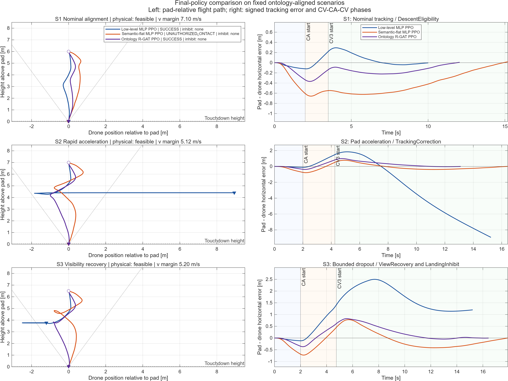
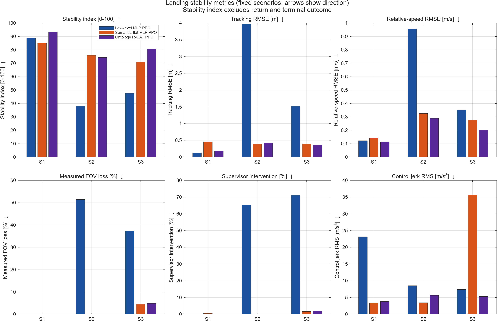
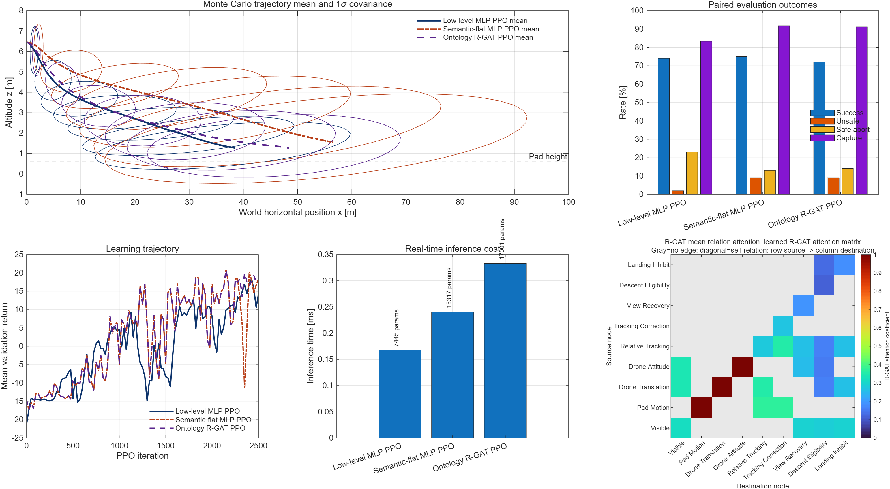
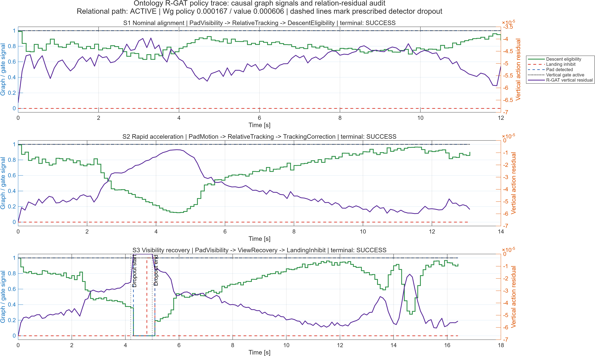
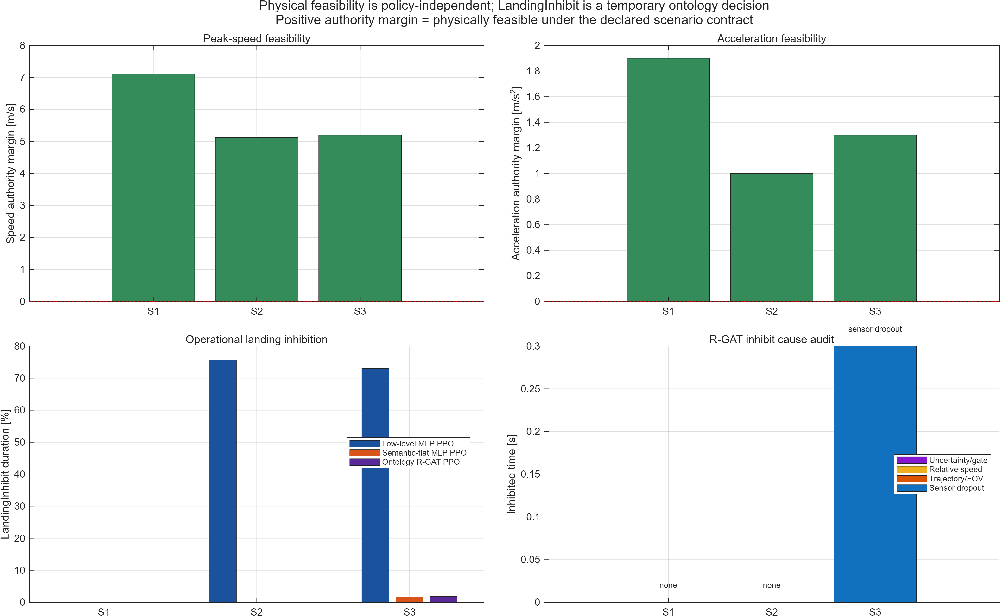

# UGV 착륙용 Causal Ontology R-GAT PPO

## Research Question

- 핵심 질문: 동일 센서·보상·안전 조건에서 인과 온톨로지 상황 그래프와 typed R-GAT 관계 문맥이 이동 UGV 착륙 정책의 성공·안전성을 개선하는지 여부
- 과제: 가속 중인 UGV 이동 패드에 대한 2차원(x–z) 드론 착륙의 부분관측 강화학습
- 난점: 패드 급가속, 기체 고정 카메라 시야 이탈, 센서 dropout, 은닉 패드 운동의 인과 추정 필요
- 비교 원리: 환경·센서·추정기·보상·행동·안전 감독기 $\Pi_s$·종료 조건 동일, Actor/Critic 상태 표현만 변경

| 구분 | 질문 |
|---|---|
| RQ1 | 동일 센서 정보에 대한 의미 특징 표현의 착륙 결과 영향 (Low-level vs Semantic-flat) |
| RQ2 | 동일 의미 특징에 대한 typed relation 문맥의 추가 영향 (Semantic-flat vs R-GAT) |
| RQ3 | 가시성 손실·패드 급가속 상황의 궤적 안정성 차이 |
| RQ4 | 은닉 참값 누수 없는 인과 그래프 정책의 실시간 추론 가능성 |

| 가설 | 내용 |
|---|---|
| H1 | 의미 특징 상태의 성공률 증가·안전 중단 감소 |
| H2 | typed relation 문맥의 Semantic-flat 대비 추가 개선 |
| H3 | 그래프 정책 추론 시간의 정책 결정 주기 $\Delta t_p$ 대비 무시 가능 수준 |

## Methods

- 결론: 가변 시간 할인 POMDP 위 세 상태 표현 PPO 정책의 통제 비교, 관계 경로는 검증 성능 가드 하 residual로만 결합
- 구성: 문제 정식화 → 시스템 모델 → 인지·추정 → 온톨로지 그래프 → 정책 구조 → 안전 감독기 → 보상 → 폐루프 실행 → 학습 → 평가
- 상세 문서: [시스템 모델](docs/refactor/SYSTEM_SPEC.md), [온톨로지·R-GAT](docs/ONTOLOGY_GRAPH_STATE_KO.md), [보상 설계](docs/refactor/REWARD_RATIONALE.md), [실험 파라미터](docs/refactor/CONFIGURATION.md), [알고리즘 구성](docs/MODULE_MAP_KO.md), [기호 정의](docs/NOTATION_KO.md)

### 문제 정식화

- 결론: 시나리오 분포 $\mathcal D$ 위의 가변 시간 할인 POMDP, 정책 입력은 인과적 관측 이력만 허용

| 요소 | 정의 |
|---|---|
| 은닉 상태 $\Xi_t$ | 드론 상태 $\xi_t$, 패드 운동 $(x_p,v_p,a_p)$, 시나리오 $\sigma$, 사전 추출 센서·외란 일정 $\mathcal W$, 감독기 문맥(하강 금지·abort 요청) |
| 관측 | 하향 카메라 측정 $(d_k,\tilde e_{x,k},\tilde\beta_k,c_k)$ + 이상적 자기 상태 |
| 정책 입력 | 추정기 $\hat\chi$ 경유 인과 관측 패킷 $o_t\in\mathbb R^{26}$, 또는 그래프 상태 $X_t$·$s_t$ |
| 행동 | $u_t\in\mathbb R^2$, $a_t=\mathrm{diag}(a_{x,\max},a_{z,\max})\tanh(u_t)$ |
| 전이 | $\Delta t_p$ 동안 $a_t$ zero-order hold, $\Delta t_s$ 단위 10회 감독기·동역학·센서·추정 갱신 |
| 보상 | 결정 단위 $r_t$, 시뮬레이터 참값 기반 계산 |
| 할인 | $\gamma_{\Delta t}=\exp(-\Delta t/\tau_\gamma)$, $\tau_\gamma=70$ s |
| 종료 | SUCCESS, SAFE_ABORT, TASK_TIMEOUT, UNSAFE_CONTACT, UNAUTHORIZED_CONTACT, MISSED_PAD_CONTACT, SAFETY_ENVELOPE_VIOLATION |

- 목적 함수: $\max_\theta\ \mathbb E_{\sigma\sim\mathcal D,\,u\sim\pi_\theta}\left[\sum_t\Big(\prod_{t'<t}\gamma_{\Delta t'}\Big)r_t\right]$
- 정보 경계: 패드 참값의 정책·그래프·감독기 입력 제외, 보상·접촉 판정·평가에만 사용
- 종료 시 bootstrap 0, 사건 발생 결정의 $\Delta t$를 사건 시각까지 단축

#### 상태 표현 비교군

- 결론: 동일 관측 정보의 표현 방식만 상이

| 비교군 | Actor/Critic 입력 | 차원 | 그래프 관계 사용 |
|---|---|---:|---|
| Low-level PPO | 정규화 관측 패킷 $o_t$ | 26 | 제외 |
| Semantic-flat PPO | $s_t=\mathrm{vec}(X_t)$ | 108 | 제외 |
| Ontology R-GAT | $s_t$ + 관계 문맥 $c_t$ | 108+4 | 포함 |


### 시스템 모델

- 결론: 평면 pitch–추력 드론, CV–CA–CV 패드, 기체 고정 하향 카메라의 결합 모델

#### 드론 동역학

- 결론: 가속도 명령의 pitch·추력 setpoint 변환 후 지연 응답 적분
- 설정점 변환: $\theta^{sp}=\mathrm{atan2}(\tilde a_x,\,g+\tilde a_z)$, $F^{sp}=m\sqrt{\tilde a_x^2+(g+\tilde a_z)^2}$
- 설정점 포화: $\lvert\theta^{sp}\rvert\le\theta_{\max}$, $0\le F^{sp}\le\kappa_F mg$
- pitch 내부 루프: $\dot\omega=\omega_n^2(\theta^{sp}-\theta)-2\zeta\omega_n\omega$, $\lvert\omega\rvert\le\omega_{\max}$, $\dot\theta=\omega+w_\theta$
- 추력 지연: $\dot F=(F^{sp}-F)/\tau_F$
- 병진 운동: $\ddot x=F\sin\theta/m$, $\ddot z=F\cos\theta/m-g$

| 항목 | 값 |
|---|---|
| 적분 주기 $\Delta t_s$ / 결정 주기 $\Delta t_p$ | 0.01 s (100 Hz) / 0.10 s (10 Hz) |
| 질량 $m$ / 중력 $g$ | 1.5 kg / 9.81 m/s² |
| 최대 추력중량비 $\kappa_F$ | 1.6 |
| 추력 지연 시정수 $\tau_F$ | 0.05 s |
| pitch 내부 루프 $\omega_n$, $\zeta$ | 10 rad/s, 1.0 |
| pitch / pitch rate 한계 $\theta_{\max}$, $\omega_{\max}$ | ±20° / ±90°/s |
| 행동 한계 $a_{x,\max}$, $a_{z,\max}$ | 2.5 m/s², 2.0 m/s² |
| 운용 고도 상한 | 지면 기준 25 m, 초과 시 envelope 위반 |
| 최대 임무 시간 $T_{\max}$ | 70 s |

#### UGV 이동 패드 시나리오

- 결론: 3구간 등속–등가속–등속 운동의 시나리오 분포 $\mathcal D$, 물리적 추종 가능 표본만 채택

| 항목 | 분포·값 |
|---|---|
| 운동 구조 | 등속(CV) → 등가속(CA) → 등속(CV) 3구간, 위치·속도 연속 |
| 1구간 속도 $v_1$ | U[0.5, 2.5] m/s |
| 2구간 가속도 $a_2$ | U[0.3, 1.5] m/s² |
| 구간 지속시간 $T_1$, $T_2$ | U[0.5, 4] s, U[0.5, 4] s |
| 3구간 지속시간 $T_3$ | U[15, 55] s |
| 3구간 속도 $v_3$ | $v_1+a_2T_2$ (파생값) |
| 초기 상대 고도 $h_0$ | U[4, 8] m |
| 패드 면 높이 $z_p$ | 지면 기준 0.6 m |
| 패드 반길이 $L_{pad}$ | 0.5 m |
| 기각 조건 | $T_d>T_{\max}$ 또는 $v_3>\bar v_d-v_{res}=9.5$ m/s |
| 드론 초기 상태 | 패드 바로 위, $v_x=v_p=v_1$, $v_z=0$, $\theta=\omega=0$, $F=mg$ |

#### 센서 모델

- 결론: 패드 측정은 하향 카메라 기하 투영만 사용, 자기 상태는 이상적 측정

| 센서·신호 | 주기 | 특징 | 잡음 |
|---|---|---|---|
| 하향 카메라 패드 검출 $d_k$ | 100 Hz | 기체 고정 하향 카메라, 시야각 $\varphi=50^\circ$, 최대 거리 $R_{\max}=50$ m, pitch에 따른 시야 회전 | 아래 외란 표 |
| 상대 수평 위치 $\tilde e_{x,k}$ | 100 Hz | 검출 시에만 유효 | 가우시안 백색잡음 $\sigma_e=0.02$ m |
| 패드 bearing $\tilde\beta_k$ | 100 Hz | 카메라 광축 기준 각도 | 가우시안 백색잡음 $\sigma_\beta=0.15^\circ$ |
| 검출 신뢰도 $c_k$ | 100 Hz | $\max\!\big(0.05,\,1-\min(1,(\tilde\beta_k/(\varphi/2))^2)\big)$, 시야 가장자리일수록 감소 | 잡음 bearing 기반 |
| 드론 자체 상태 ($h$, $v_x$, $v_z$, $\theta$, $\omega$) | 10 Hz 정책 입력 | 시뮬레이터 참값 | 미적용 (이상적 자기 상태) |
| 정책 관측 패킷 $o_t$ | 10 Hz | 26차원 (자기 운동 6, 패드 track 8, 가시성 7, 과제 기억 5) | 추정기 출력 경유 |

- 검출 조건: 카메라 깊이 $>0$, 거리 $\le R_{\max}$, $\lvert\beta\rvert<\varphi/2$, $\delta_k=0$
- 오검출·측정 지연: 미모델링
- 측정 시각: 단조 증가 timestamp 전제

#### 외란과 잡음

- 결론: 센서 dropout·pitch 외란·측정 잡음의 정책 독립 사전 추출 일정 $\mathcal W$

| 종류 | 발생 확률 | 설정 |
|---|---|---|
| 측정 잡음 | 항상 | $\sigma_e=0.02$ m, $\sigma_\beta=0.15^\circ$ 가우시안 |
| 센서 dropout 없음 | 50% | 전 구간 정상 검출 (FOV 이탈 제외) |
| 짧은 dropout ($\delta_k=1$) | 25% | 지속 U[0.2, 0.5] s, 시작 U[0.5, $T_d-5$] s |
| 지속 dropout ($\delta_k=1$) | 25% | 지속 U[3.5, 5.0] s, 시작 U[0.5, $T_d-5$] s |
| pitch 외란 $w_\theta$ | 25% (dropout과 독립) | U[−2, 2] °/s, 지속 U[0.15, 0.4] s, 시작 U[0.5, $T_d-1$] s |
| UGV 기동 | 항상 | CA 구간 가속 (과제 고유 외란) |
| 바람·돌풍·지면효과 | 미적용 | — |
| 드론 상태 센서 잡음 | 미적용 | — |

- 난수 구조: 시나리오·센서·정책 독립 난수열
- 비교군 간 동일 seed → 동일 $\sigma$·dropout·pitch 외란·측정 잡음 열

### 인지·상태 추정 알고리즘

- 결론: 기하 투영 검출 + 인과적 등가속도 innovation 필터, 패드 참값 미사용

#### 검출

| 항목 | 설정 |
|---|---|
| 검출 방식 | 영상 처리 없는 기하 투영 (패드 중심의 기체 고정 카메라 좌표 투영) |
| 출력 | $d_k$, $\tilde e_{x,k}$, $\tilde\beta_k$, $c_k$, 유효 여부 |
| 예측 bearing·FOV margin | 0.5 s 앞 상대 위치·pitch 외삽 후 재투영 |

#### 추정 갱신

- 결론: 등가속도 예측과 위치 innovation 기반 3이득 보정의 순차 적용
- 예측 (검출 간 경과 $\Delta$): $\hat x_p\leftarrow\hat x_p+\hat v_p\Delta+\tfrac12\hat a_p\Delta^2$, $\hat v_p\leftarrow\hat v_p+\hat a_p\Delta$, $\hat a_p\leftarrow\hat a_p e^{-\Delta/\tau_a}$
- innovation: $\nu_k=(x_k+\tilde e_{x,k})-\hat x_p$
- 이상치 gate: $\lvert\nu_k\rvert\le\max\!\big(4\max(\hat\sigma_p,\sigma_e),\,0.25\ \mathrm{m}\big)$일 때만 채택
- 보정 ($\Delta t_m$: 직전 채택 측정 이후 경과): $\hat x_p\leftarrow\hat x_p+k_p\nu_k$, $\hat v_p\leftarrow\hat v_p+k_v\nu_k/\Delta t_m$, $\hat a_p\leftarrow\hat a_p+2k_a\nu_k/\Delta t_m^2$
- 가속도 포화: $\lvert\hat a_p\rvert\le3.0$ m/s²

| 항목 | 설정 |
|---|---|
| 측정 입력 | 유효 측정 $\tilde e_{x,k}$ + 동기화된 자기 위치 $x_k$ |
| innovation 이득 $k_p$, $k_v$, $k_a$ | 0.20, 0.02, 0.00005 |
| 가속도 감쇠 시정수 $\tau_a$ | 1.5 s |
| 공정 잡음 (불확실성 전파) | 가속도 표준편차 1.5 m/s² |
| 초기 불확실성 $\hat\sigma_p$, $\hat\sigma_v$, $\hat\sigma_a$ | 2 m, 3 m/s, 2 m/s² |
| 초기화 | 첫 유효 측정으로 $\hat x_p$ 설정, $\hat v_p$ 사전값 = 드론 $v_x$, $\hat a_p=0$ |
| 미검출 구간 | 예측만 수행, 불확실성 증가, $\Delta t_{\mathrm{loss}}$ 누적 |
| 참값 사용 | 미사용 |

### 온톨로지 상황 그래프

- 결론: 관측 패킷 $o_t$의 결정적 의미화로 구성한 9노드·26간선·5관계 유형 그래프 $\mathcal G$, 학습 대상 아님


#### 노드

| 그룹 | 노드 | 핵심 의미 |
|---|---|---|
| Perception | PadVisibility | 검출·bearing·FOV margin·신뢰도 |
| Perception | ViewRecovery | 미관측 시간·예측 bearing·복구 긴급도 |
| Tracking | PadMotion | 패드 속도·가속도 추정·불확실성 |
| Tracking | RelativeTracking | 상대 위치·상대 속도·추정 불확실성 |
| Tracking | TrackingCorrection | 방향 보존 수평 복구 문맥 |
| Vehicle | DroneTranslation | 고도·수평 속도·수직 속도 |
| Vehicle | DroneAttitude | pitch·pitch rate |
| Safety | DescentEligibility | 정렬·속도·자세·신뢰도 기반 하강 허용도 |
| Safety | LandingInhibit | 일시적 하강 금지·abort 상태 |

#### 관계

- 의미 간선 17개 + 자기 간선 9개 = $\lvert\mathcal E\rvert=26$
- 관계 유형 $\mathcal R$: informs, affects_visibility, supports, inhibits, self
- 임의 역방향 간선 추가 제외
- 고립 노드 제외
- 보상·행동·성공 여부·미래 상태 노드 제외

#### 노드 특징

- 결론: 전 노드 공통 12차원 특징 형식, 노드 유형은 $\kappa_i$로 식별

$$
x_i=[p_i,\tilde p_i,s_i,\tilde s_i,m_i,c_i,u_i,\tau_i,q_i,T_i,1,\kappa_i]^\top\in\mathbb R^{12}
$$

- $p_i,s_i$: 주요·보조 의미 크기
- $\tilde p_i,\tilde s_i$: 방향 보존 부호 특징
- $m_i$: 유효성 mask
- $c_i$: 신뢰도
- $u_i$: 불확실성
- $\tau_i$: 변화 추세
- $q_i$: 긴급도
- $T_i$: 잔여 임무 시간
- $\kappa_i=i/9$: 노드 유형 식별 특징
- 전 특징 $[-1,1]$ clipping, $p_i\in[0,1]$
- 특징 행렬 $X_t=[x_1,\dots,x_9]\in\mathbb R^{12\times9}$, raw semantic 상태 $s_t=\mathrm{vec}(X_t)$

### 정책 구조

- 결론: raw semantic MLP 정책에 gate 적용 관계 residual을 더하는 가산 구조, 관계 경로 제거 시 semantic-flat과 동일 구조

#### Typed R-GAT message passing

- 단일 R-GAT 층, 관계 $r$ 간선 $i\rightarrow j$의 attention logit:

$$
e_{ij}^{(r)}=\mathrm{LeakyReLU}_{0.2}\!\left(
{a_r}^{\top}[W_r x_i\,\Vert\,W_r x_j\,\Vert\,\rho_r]
\right)
$$

- $W_r\in\mathbb{R}^{8\times12}$, $\rho_r\in\mathbb{R}^{4}$, $a_r\in\mathbb{R}^{20}$
- 목적 노드 기준 정규화 (전 관계 유형·자기 간선 포함 입력 간선 전체)와 노드 갱신:

$$
\alpha_{ij}^{(r)}=
\frac{\exp(e_{ij}^{(r)})}
{\sum_{(k,r')\in\mathcal{N}(j)}\exp(e_{kj}^{(r')})+10^{-9}},
\qquad
h_j=\tanh\!\left(\sum_{(i,r)\in\mathcal{N}(j)}
\alpha_{ij}^{(r)}W_r x_i+W_0x_j+b_0\right)
$$

- 4개 의미 그룹 readout ($\bar h_g$: 그룹 내 노드 평균, $W_c\in\mathbb{R}^{4\times32}$, 0 초기화):

$$
c_t=\tanh\!\left(W_c\,
[\bar h_{\mathrm{perception}}\Vert
\bar h_{\mathrm{tracking}}\Vert
\bar h_{\mathrm{vehicle}}\Vert
\bar h_{\mathrm{safety}}]+b_c\right)
$$

#### Actor/Critic 결합

- Actor 평균: raw semantic bypass $s_t$ 보존 + 관계 residual

$$
\mu_t=f_{\pi}(s_t)+\tilde\delta_t,
\qquad
\delta_t=W_{\pi}c_t,\quad W_\pi\in\mathbb{R}^{2\times4}
$$

- 추가 하강 residual의 의미 제약 (하강 허용 gate $g_t$):

$$
\tilde\delta_{z,t}=
\begin{cases}
\delta_{z,t}, & \delta_{z,t}\ge 0,\\
g_t\,\delta_{z,t}, & \delta_{z,t}<0,
\end{cases}
\qquad
\tilde\delta_{x,t}=\delta_{x,t},
\qquad g_t\in[0,1]
$$

- Critic: gate 없는 선형 관계 항

$$
V_\phi(s_t)=f_V(s_t)+w_V^{\top}c_t,\qquad w_V\in\mathbb R^4
$$

- $g_t$: DescentEligibility 노드 primary 특징, $[0,1]$ clipping, gradient 미전달
- $g_t$ 구성: 신뢰도 × track 초기화 × (1−위치 위험)(1−속도 위험)(1−자세 위험)(1−각속도 위험) × (1−하강 금지)
- 하강 금지(LandingInhibit) 활성 시 $g_t=0$, 추가 하강 residual 차단
- 상승·제동 residual과 수평 residual 유지
- Actor·Critic 그래프 부호기: 사전학습 부호기 복사 후 독립 파라미터
- 정책 분포: $u_t\sim\mathcal N(\mu_t,\mathrm{diag}(\sigma_\pi^2))$, 평가 시 $u_t=\mu_t$

### 안전 감독기·종료 조건

- 결론: 세 비교군 공통 감독기 $\Pi_s$가 관측 패킷만으로 하강 차단·제동·복구 상승 개입

#### 감독기 개입 규칙

- 입력: 자기 상태·관측 패킷·요청 가속도 $a_t$, 패드 참값 제외
- 정지 고도: $h_{stop}=v_{down}t_{resp}+\dfrac{v_{down}^2}{2a_{brake}}$, $v_{down}=\max(0,-v_z)$, $a_{brake}=\max\!\big(10^{-6},(\kappa_F-1)g\big)$, $t_{resp}=0.15$ s

| 우선 | 조건 | 개입 |
|---:|---|---|
| 1 | abort 요청 | 추정 track 기반 수평 추종 + $h<1.0$ m 또는 $v_z<-0.10$ m/s 시 $\tilde a_z=a_{z,\max}$, 그 외 고도 유지 |
| 2 | 하강 금지 $\wedge(v_z<0\vee h\le h_{stop})$ | $\tilde a_z\leftarrow\max(\tilde a_z,\min(a_{z,\max},a_{brake}))$ |
| 3 | $h\le h_{stop}\wedge v_z<-0.30$ m/s | $\tilde a_z\leftarrow\max(\tilde a_z,\min(a_{z,\max},a_{brake}))$ |

- 하강 금지: 재포착 미충족(마지막 검출 후 0.5 s 초과 또는 track 신뢰도 0.25 미만) 또는 abort 요청
- abort 요청: $\Delta t_{\mathrm{loss}}>3.0$ s, 복구 상승 중 재포착 시 해제
- PPO likelihood·제어 비용: 감독기 적용 전 $u_t$·$\bar a_t$ 기준

#### 종료 판정

| 우선 | 결과 | 조건 | 종료 보상 |
|---:|---|---|---:|
| 1 | MISSED_PAD_CONTACT | 접촉 시 $\lvert e_x\rvert>L_{pad}$ | −40 |
| 1 | UNAUTHORIZED_CONTACT | 패드 내 접촉, 하강 금지 또는 abort 요청 상태 | −40 |
| 1 | UNSAFE_CONTACT | 허가 접촉, 착륙 한계 중 하나 위반 | −40 |
| 1 | SUCCESS | 패드 내·허가·착륙 한계 충족 | +25 |
| 2 | SAFETY_ENVELOPE_VIOLATION | pitch·pitch rate 한계, 고도 상한 25 m, 지면 아래, 비유한 상태 | −40 |
| 3 | SAFE_ABORT | abort 요청 후 8.0 s 이상, $h\ge1.0$ m, $\lvert v_z\rvert\le0.10$ m/s | −15 |
| 4 | TASK_TIMEOUT | $t\ge T_d$ | −12 |

- 접촉 판정: $h$의 0.04 m 하향 통과, 선형 보간 시각의 접촉 직전 상태로 분류
- 착륙 한계: $\lvert\Delta v_x\rvert\le0.35$ m/s, $\lvert v_z\rvert\le0.30$ m/s, $\lvert\theta\rvert\le5^\circ$, $\lvert\omega\rvert\le10^\circ$/s

### 보상 설계

- 결론: 세 비교군 동일 보상, 종료 보상과 dense 진척 항의 분리
- 결정 단위 보상:

$$
r_t=B_t-\frac{\Delta t}{T_{ref}}\left(w_g c_{goal,t}+w_v c_{view,t}+w_u c_{ctrl,t}\right)+w_r(\psi_t-\psi_{t-1})+\gamma_{\Delta t}\Phi_t-\Phi_{t-1}
$$

- $B_t$: 종료 보상 (위 종료 판정 표), 비종료 결정에서 0
- $c_{goal}$: $e_x$·$h$의 정규화 bounded 오차 비용
- $c_{view}$: $\min(1,(\beta/(\varphi/2))^2)$, 미검출 시 1
- $c_{ctrl}=\tfrac12\lVert\bar a_t\rVert^2$
- $\psi_t\in(0,1]$: 착륙 준비도 (착륙 한계 대비 상대 상태 위험의 지수 변환)
- $\Phi_t=-w_p c_{goal,t}$, 종료 시 0: 시간 할인 일치 potential shaping
- 가중치: $T_{ref}=70$ s, $w_g=2.0$, $w_v=1.0$, $w_u=0.25$, $w_r=8.0$, $w_p=2.0$
- 상세 근거: [보상 설계](docs/refactor/REWARD_RATIONALE.md)

### 폐루프 실행 알고리즘

- 결론: 10 Hz 정책 결정과 100 Hz 감독기·동역학·인지 루프의 2중 주기 구조, 실행 중 역전파 없음

**Algorithm 1. 결정 1회 ($t\rightarrow t+1$)**

1. 관측 구성: 자기 상태·추정 $\hat\chi$·가시성·과제 기억으로 $o_t\in\mathbb R^{26}$ 구성
2. 그래프 구성: $o_t$ 의미화로 $X_t\in\mathbb R^{12\times9}$, $s_t=\mathrm{vec}(X_t)$ 구성 (그래프 비교군 한정)
3. 관계 문맥: R-GAT message passing·그룹 readout으로 $c_t$ 계산 (R-GAT 한정)
4. 정책: $\mu_t=f_\pi(\cdot)+\tilde\delta_t$, $u_t\sim\pi_\theta(u\mid\cdot)$, $a_t=\mathrm{diag}(a_{x,\max},a_{z,\max})\tanh(u_t)$
5. 물리 루프: $k=1,\dots,10$에 대해 반복
   1. 감독기: $\tilde a_k=\Pi_s(a_t,\xi_k,o_k)$
   2. 동역학: $(\theta^{sp},F^{sp})$ 변환 후 $\xi_{k+1}$ 적분, 외란 $w_\theta$ 반영
   3. 종료 판정: 접촉·envelope·중단·시간 초과 검사, 사건 시 루프 종료·$\Delta t$ 단축
   4. 인지: 검출 $(d_k,\tilde e_{x,k},\tilde\beta_k,c_k)$, $\delta_k$ 적용
   5. 추정: $\hat\chi$ 예측·innovation 보정, 하강 금지·abort 문맥 갱신
6. 보상: 참값 기반 $r_t$ 계산, 종료 여부 반환

### 학습 알고리즘

- 결론: 세 비교군 동일 PPO·커리큘럼·선택 규칙, R-GAT만 그래프 사전학습·관계 경로 적응·성능 가드 추가

**Algorithm 2. PPO 학습**

1. 초기화: Actor $\pi_\theta$·Critic $V_\phi$ 무작위 초기화, 모방학습 미사용
2. 그래프 사전학습 (R-GAT 한정): $\mathcal S_{tr}$ 인과 그래프의 masked same-time 노드 특징 재구성, Actor·Critic 부호기로 복사
3. 반복 $i=1,\dots,2500$:
   1. 난이도: 성능 기반 승급과 일정 기반 하한으로 커리큘럼 난이도 $\ell$ 결정
   2. 수집: 쉬운·중간·현재 난이도 혼합 6개 에피소드를 확률적 정책으로 rollout
   3. Advantage: 가변 할인 GAE, $\eta_t=r_t+\gamma_{\Delta t}V_\phi(s_{t+1})-V_\phi(s_t)$, $\hat A_t=\eta_t+\gamma_{\Delta t}\lambda\hat A_{t+1}$, 종료 시 bootstrap 0, 배치 정규화
   4. 갱신: 8 epoch × mini-batch 256, clipped surrogate $\min\!\big(\varrho_t\hat A_t,\mathrm{clip}(\varrho_t,1-\epsilon,1+\epsilon)\hat A_t\big)$ + 엔트로피 항, Critic 제곱오차, Adam·gradient L2 norm 1.0 clipping
   5. 로그 표준편차 하한: $\log\sigma_\pi\ge-2.5$
   6. 처음 2 iteration: Critic만 갱신
   7. 관계 경로 적응 (R-GAT, $i>2250$): raw semantic MLP $f_\pi,f_V$ 고정, $W_r,a_r,W_c,b_c,W_\pi,w_V$만 갱신, $\rho_r,W_0,b_0$ 고정
   8. 검증 (25 iteration마다): $\mathcal S_{val}$ 결정론적 평가, 선택 점수 $J$ 계산
   9. 선택: $\ell\ge1$ 도달 정책 중 최고 $J$ 보존, 관계 적응 구간 R-GAT는 기존 최고 대비 $J$ +5.0 초과 개선 요구
4. 관계 경로 보정 (R-GAT 한정): Algorithm 3 적용
5. 최종 평가: 선택 정책의 $\mathcal S_{te}$ 결정론적 평가

- $\varrho_t=\pi_\theta(u_t\mid s_t)/\pi_{\theta_{old}}(u_t\mid s_t)$: 확률 비율
- 선택 점수: $J=1000\,p_s-2500\,p_u-10\,p_\tau-100\,p_a+\bar G$

**Algorithm 3. 관계 경로 성능 가드**

1. 활성 검사: Algorithm 2 선택 정책의 $\lVert W_c\rVert_F,\lVert W_\pi\rVert_F,\lVert w_V\rVert_2>0$ 시 종료, 비활성 시 해당 정책을 기준(flat-equivalent anchor)으로 보존
2. 관계 전용 보정: raw 정책 고정, 공칭 난이도 관계 전용 PPO 25 iteration × 6 에피소드 × 4 epoch
3. 배율 탐색: $\nu_{rel}\in\{1,0.75,0.5,0.25,0.1,0.05,0.02,0.01,0.005,0.002,0.001\}$ 내림차순, $(W_c,b_c)\leftarrow\nu_{rel}(W_c,b_c)$
4. 채택 조건 ($\mathcal S_{val}$ 100개): $p_s$ 비하락, $p_u,p_a,p_\tau$ 비증가, $\bar G$·$J$ 감소 0.25 이내, 평균 residual 크기 $[10^{-6},\,0.005]$, 관계 경로 활성
5. 결과: 조건 충족 최대 배율 채택, 최종 $\nu_{rel}=0.001$

#### PPO 하이퍼파라미터

| 항목 | 값 |
|---|---|
| PPO 반복 수 | 2,500 iteration (조기 종료 없음) |
| 반복당 에피소드 | 6 |
| 모델당 학습 에피소드 | 15,000 |
| 반복당 갱신 | 8 epoch, mini-batch 256 |
| 할인 $\gamma_{\Delta t}$ / GAE $\lambda$ | $\exp(-0.1/70)\approx0.99857$ / 0.95 |
| clip 비율 $\epsilon$ | 0.2 |
| 학습률 (Adam) | Actor 5×10⁻⁴, Critic 1×10⁻³, 그래프 부호기 3×10⁻⁴ |
| 엔트로피 가중치 | 0.0025 |
| 탐색 $\log\sigma_\pi$ | 초기 −1.1, 하한 −2.5 |
| gradient clipping | L2 norm 1.0 |
| Critic warm-up | 처음 2 iteration |
| MLP $f_\pi,f_V$ 구조 | 은닉층 2개 × 48 |
| R-GAT 구조 | 노드 임베딩 8, 관계 임베딩 4, 4개 의미 그룹 readout |
| 관계 경로 적응 | 마지막 10% (2,251 iteration 이후) |
| 학습 난수 seed | 20240501, 단일 학습 seed |

#### 커리큘럼 (학습 에피소드 한정)

- 결론: 난이도 $\ell\in[0,1]$의 단조 증가, 평가는 항상 공칭 분포 $\mathcal D$

| 항목 | 설정 |
|---|---|
| 승급 | 25 iteration 평가창의 착륙률 ≥ 10%가 3창 연속 시 $\ell\leftarrow\ell+0.1$ |
| 일정 하한 | 학습 30%(750 iteration) 이후 선형 상승, 80%(2,000 iteration)에서 $\ell=1$ |
| 초기 고도 | 공칭 $h_0$의 0.025–0.05배(0.1–0.4 m)에서 공칭 범위로 확장 |
| UGV 운동 | $v_1,a_2$ 범위 0.15배에서 시작, 학습 65% 지점까지 공칭 복귀 |
| 장기 시야 상실 한계 | 12 s에서 시작, 학습 55% 지점까지 공칭 3 s 복귀 |
| 착륙 속도 한계 | 공칭의 2배에서 공칭으로 수렴 |
| 실패 종료 보상 | $-20+(-40+20)\ell$, $\ell=1$에서 공칭 −40 |
| 망각 방지 replay | 6개 배치 중 쉬운($\ell=0$) 1개·중간($\ell/2$) 1개 |

#### 그래프 사전학습 (R-GAT 한정)

| 항목 | 값 |
|---|---|
| 목표 | masked same-time 노드 특징 재구성 |
| 데이터 | $\mathcal S_{tr}=\{1,\dots,12\}$, 에피소드당 최대 80 결정 |
| 설정 | 8 epoch, batch 128, mask 확률 0.25, 학습률 1×10⁻³ |
| 입력 제외 | 행동, 보상, 성공 여부, 미래 상태, 교사 명령, 패드 참값 |

### 평가 프로토콜

- 결론: 선택·보고 표본의 완전 분리, 결정론적 정책 평가

#### 데이터 분할

| 구분 | Seed 집합 | 에피소드 수 (모델당) | 용도 |
|---|---|---:|---|
| PPO 학습 | 학습 난수열 추출 seed (분할 집합과 별도) | 15,000 | 정책 학습 |
| 그래프 사전학습 | $\mathcal S_{tr}=\{1,\dots,12\}$ | 12 | R-GAT 부호기 사전학습 |
| 검증 | $\mathcal S_{val}=\{2001,\dots,2100\}$ | 100 × 101회 | 학습 전 1회 + 25 iteration마다 정책 선택 ($\ell\ge1$ 정책 한정) |
| 시험 | $\mathcal S_{te}=\{3001,\dots,3100\}$ | 100 | 최종 성능 보고 (선택 미사용) |
| 대표 시나리오 | S1–S3 고정 | 3 | 궤적·안정성 분석 |
| 추론 시간 측정 | — | 500회 반복 | 상태 구성 + Actor 순전파 (표), Actor+Critic 합계 별도 |

- 평가 정책: 결정론적 ($u_t=\mu_t$)
- 평가 분포: 커리큘럼 미적용 공칭 $\mathcal D$
- Monte Carlo 분석: $\mathcal S_{te}$와 동일 표본
- 학습 반복: 모델당 1회 (단일 학습 seed)
- 지표: $p_s,p_u,p_a,p_\tau$, $\bar G$, $SI$, $m_v,m_a,m_T$, 추론 시간

#### 대표 시나리오 파라미터

| 시나리오 | $v_1$ [m/s] | $a_2$ [m/s²] | $T_1$ [s] | $T_2$ [s] | $T_3$ [s] | $h_0$ [m] | 센서 사건 |
|---|---:|---:|---:|---:|---:|---:|---|
| S1 정상 정렬 | 1.50 | 0.60 | 2.00 | 1.50 | 28.0 | 6.0 | 없음 |
| S2 급가속 | 1.00 | 1.50 | 2.00 | 2.25 | 28.0 | 7.0 | 없음 |
| S3 가시성 손실 | 1.00 | 1.20 | 2.00 | 2.75 | 30.0 | 6.5 | dropout 4.2–5.0 s |

#### 계산 환경

| 항목 | 설정 |
|---|---|
| 시뮬레이터·학습 | 자체 구현 2D(x–z) 시뮬레이터·MLP·R-GAT·PPO·Adam, 외부 물리엔진·학습 라이브러리 미사용 |
| 수집 병렬화 | 반복 내 에피소드 병렬 수집, 에피소드별 독립 난수열로 순차 수집과 동일 결과 |
| 학습 호스트 | Intel Core i7-14700F (20코어), RAM 16 GB, Windows 11 |
| 학습 소요 시간 | Low-level 1.14 h, Semantic-flat 1.55 h, R-GAT 1.91 h |

### 재현

- 결론: 프로젝트 폴더 기준 세 명령의 전체·단일 시나리오·실시간 비교 재현

```matlab
run
run_scenario('S3')
run_live('S3')
```

- `run`: 세 비교군 학습·검증 선택·시험 평가 전체 수행
- `run_scenario('S3')`: 학습 정책의 단일 대표 시나리오 평가
- `run_live('S3')`: 세 비교군 동일 조건 실시간 동시 재생
- Simulink 실행: `run(struct('trainingBackend','simulink'))`, `run_scenario('S3',struct('backend','simulink'))`, 구성·검증은 [Simulink 실행·학습](docs/SIMULINK_KO.md)
- 3차원 옵션: `run(struct('spatialDimension',3))`, `run_scenario('S3',struct('spatialDimension',3))`, `run_live('S3',struct('spatialDimension',3))`, 결과 `results/spatial3d`, 모델은 [3차원 확장 옵션](docs/SPATIAL_3D_KO.md)

## Main findings

- 결론: 시험 성능의 통계적 우열 부재, R-GAT의 대표 시나리오 전 성공·실시간 추론 확인, 관계 경로 기여는 $10^{-5}$ 수준 residual로 제한

| 번호 | 발견 | 근거 |
|---|---|---|
| F1 | 세 모델 성공률 72–75%, Wilson 95% 구간 전부 중첩 | 시험 100 seed, 반폭 약 ±9 pp |
| F2 | 의미 특징의 안전 중단 감소·위험 접촉 증가 교환 (H1 부분 지지) | $p_a$ 23% → 13%, $p_u$ 2% → 9% (Fisher $p\approx0.058$) |
| F3 | typed relation 문맥의 추가 개선 미확인 (H2 미지지) | R-GAT vs Semantic-flat: $p_s$ −3 pp, $\bar G$ −0.566 |
| F4 | R-GAT의 S1~S3 전 성공, S1·S3 안정성 지수 최고 | $SI$ 93.5 / 74.3 / 80.6 |
| F5 | 실시간 추론 가능 (H3 지지) | R-GAT 정책 추론 0.179 ms $\ll\Delta t_p=100$ ms |
| F6 | 관계 경로 활성, 행동 기여 미소 | $\nu_{rel}=0.001$, 평균 residual $10^{-5}$ 수준 |
| F7 | 대표 시나리오 실패 원인은 물리적 불가능이 아닌 일시적 하강 금지 | 전 시나리오 $m_v,m_a>0$ |

### 평가 조건

- 평가 시점: 2026-10-06 09:31 KST, 기존 학습 정책 재평가·결과율 동일 재현
- 성능 평가 표본: 시험 seed 집합 $\mathcal S_{te}=\{3001,\dots,3100\}$ 100개
- 대표 시나리오·그림: 최종 활성 R-GAT 정책 재실행
- 추론 시간: 동일 호스트(Intel i7-14700F) 단일 실행 500회 반복 평균, 관측 패킷·그래프 구성 + Actor 순전파

### 시험 seed 100개 평가

- 결론: 성공률 차이 3%p 이내, 위험 접촉률은 Low-level 최저

| 모델 | 성공률 $p_s$ | 위험 접촉률 $p_u$ | 안전 중단률 $p_a$ | 시간 초과율 $p_\tau$ | 평균 return $\bar G$ | 파라미터 | 추론 시간 |
|---|---:|---:|---:|---:|---:|---:|---:|
| Low-level PPO | 74% | 2% | 23% | 1% | 19.139 | 7,445 | 0.105 ms |
| Semantic-flat PPO | 75% | 9% | 13% | 3% | 18.496 | 15,317 | 0.115 ms |
| Ontology R-GAT PPO | 72% | 9% | 14% | 5% | 17.930 | 17,001 | 0.179 ms |

- 단일 학습 seed의 최종 정책 평가
- 모델 선택 미사용 표본 $\mathcal S_{te}$ 사용
- R-GAT 우월성 미확인
- 다중 학습 seed 평균·분산 검증 필요

### 시험 결과율 신뢰구간

- 결론: 단일 학습 seed 평가 표본 분산 기준 유의한 우열 부재

| 모델 | $p_s$ [Wilson 95%] | $p_u$ | $p_a$ | $p_\tau$ |
|---|---|---|---|---|
| Low-level | 74 [64.6, 81.6] | 2 [0.6, 7.0] | 23 [15.8, 32.2] | 1 [0.2, 5.4] |
| Semantic-flat | 75 [65.7, 82.5] | 9 [4.8, 16.2] | 13 [7.8, 21.0] | 3 [1.0, 8.5] |
| Ontology R-GAT | 72 [62.5, 79.9] | 9 [4.8, 16.2] | 14 [8.5, 22.1] | 5 [2.2, 11.2] |

- 참고 검정: 독립 표본 Fisher 양측, paired 구조 미반영
- 상세: [평가 프로토콜·결과](docs/VALIDATION_KO.md), [연구 결과 보고](docs/refactor/FINAL_REPORT.md), [관계 해석 지표](docs/ONTOLOGY_VIEW_KO.md)

### 고정 대표 시나리오 평가

- 결론: R-GAT의 S1~S3 전 성공, S1·S3 안정성 지수 최고

| 시나리오 | Low-level | Semantic-flat | Ontology R-GAT | 안정성 지수 $SI$ 비교 |
|---|---|---|---|---|
| S1 정상 정렬 | 성공 | 비허가 접촉 | 성공 | 88.7 / 85.0 / **93.5** |
| S2 급가속 | 안전 중단 | 성공 | 성공 | 37.9 / **75.9** / 74.3 |
| S3 가시성 손실 | 안전 중단 | 성공 | 성공 | 47.6 / 70.8 / **80.6** |

- 사전 선언 시나리오 사용
- 모델별 동일 물리 조건·센서 사건·잡음 난수열 적용
- S1~S3 전부 양의 authority margin $m_v,m_a$ 확인
- S3의 일시적 LandingInhibit 원인: 센서 dropout





### Monte Carlo 평균·분산 궤적

- 결론: 시험 표본 전체의 궤적 분산·결과율·학습 추이·관계 attention의 통합 제시



- 왼쪽 상단: $\mathcal S_{te}$ 100개 평균 궤적과 1시그마 공분산 윤곽
- 오른쪽 상단: 동일 표본의 성공·위험·안전 중단·포착률
- 왼쪽 하단: 학습 중 검증 return 궤적 (25 iteration 간격)
- 가운데 하단: 관측 패킷·그래프 구성과 Actor·Critic 순전파 합계 시간 (25회 반복)
- 오른쪽 하단: 최종 R-GAT 관계 유형별 평균 attention $\alpha^{(r)}_{ij}$

### 최종 정책 관계 경로 검증

- 결론: Actor·Critic 양쪽 관계 경로 비영 활성, 행동 기여는 $10^{-5}$ 수준의 미소 residual

| 항목 | Actor | Critic |
|---|---:|---:|
| 그룹 readout 크기 $\lVert W_c\rVert_F$ | 0.0001665 | 0.0006056 |
| 관계 head 크기 ($\lVert W_\pi\rVert_F$ / $\lVert w_V\rVert_2$) | 0.1517 | 0.4792 |
| 관계 경로 활성 | 예 | 예 |

- 활성화 원리: flat-equivalent 기준 정책 보존 후 관계 파라미터만 미세조정
- 선택 근거: $\mathcal S_{te}$ 미사용, $\mathcal S_{val}$ 100개 기반 성능 가드
- 시험 결과율: 성공 72%·위험 접촉 9%·안전 중단 14%·시간 초과 5% 유지
- 시험 평균 return: 17.873에서 17.930으로 증가
- 시험 평균 절대 관계 residual $\lvert\tilde\delta_t\rvert$: 수평 $1.27\times10^{-5}$·수직 $3.86\times10^{-5}$
- 제한: 안전 보존을 위한 작은 관계 residual, 다중 학습 seed 우월성 미확인



### 착륙 가능성과 LandingInhibit

- 결론: 대표 시나리오 실패 원인은 물리적 불가능이 아닌 일시적 하강 금지·정책 거동
- 물리적 착륙 가능성: 정책 독립 authority margin 평가
- 속도 margin: $m_v=(\bar v_d-v_{res})-\max_t v_p(t)$, $\bar v_d=10$ m/s 지속 비행속도, $v_{res}=0.5$ m/s 여유
- 가속도 margin: $m_a=a_{x,\max}-a_2$
- 시간 margin: $m_T=T_{\max}-T_d$
- 물리 가능 조건: $m_v\ge0$, $m_a>0$, $m_T\ge0$
- LandingInhibit 의미: 영구적 착륙 불가 판정이 아닌 현재 시점 하강 금지
- 원인 분해: 센서 dropout, 궤적·FOV 이탈, 상대 속도, 추정 불확실성·gate



## Assumptions

- 결론: 2차원 이상화 동역학·이상적 자기 상태·기하 투영 검출·정책 독립 외란 일정의 전제

| 구분 | 가정 |
|---|---|
| 운동 공간 | x–z 평면 운동, 횡방향·yaw·roll 운동 제외 |
| 기체 모델 | 평면 pitch–추력 모델, 파라미터는 시뮬레이션 기준값이며 실기체 식별값 아님 |
| 자기 상태 | 고도·속도·pitch·pitch rate의 잡음 없는 이상적 측정 |
| 패드 검출 | 영상 처리 없는 기하 투영, 오검출·측정 지연 부재, 가우시안 백색잡음만 적용 |
| 패드 기하 | 패드 면 높이 $z_p$·반길이 $L_{pad}$ 기지 |
| UGV 운동 | 등속–등가속–등속 3구간, 평면 직선 주행 |
| 외란 | dropout·pitch rate 외란의 에피소드 시작 전 추출, 정책 행동과 독립 |
| 환경 | 바람·돌풍·지면효과 부재 |
| 임무 정보 | 잔여 임무 시간 $T_d-t$의 관측 가능 |
| 보상 | 시뮬레이터 참값의 보상·접촉 판정 사용 허용, 정책 입력 사용 금지 |
| 감독기 | 정지 고도 계산의 제동 가속도 $(\kappa_F-1)g\approx5.9$ m/s² 가정, 실제 적용 제동은 $a_{z,\max}=2.0$ m/s² 상한 |
| 안전 판정 | 접촉 높이 0.04 m·착륙 한계 임계값의 고정 규칙 기반 분류 |

## Limitations

- 결론: 단일 학습 seed·이상화 시뮬레이터 결과, 관계 구조 효과·실기체 일반화 주장 제외
- 단일 학습 seed 결과, 학습 seed 간 분산 미반영
- 시험 100 episode의 표본 크기, 결과율 차이 검출력 부족 (반폭 약 ±9 pp)
- 관계 readout 축소 배율 $\nu_{rel}=0.001$, 관계 경로의 행동 기여 미소
- 2차원 연구용 시뮬레이터, 3차원·실비행 검증 부재
- 이상적 자기 상태 관측, 자기 상태 센서 잡음·지연 미반영
- 바람·돌풍·지면효과 외란 미적용
- 패드 오검출·측정 지연 미모델링
- 감독기 정지 고도의 낙관적 제동 가정
- 공칭 범위의 시나리오 기각 조건 실질 비활성 ($v_3\le8.5$ m/s, $T_d\le63$ s)
- 노드 특징의 선형 비율 포화 $\min(\lvert y\rvert/y_0,1)$, 큰 오차 구간 정보 포화
- PPO 학습 seed의 검증·시험 seed와 명시적 배제 부재, 중복 확률 약 0.14%
- 실제 비행 안전성 인증 제외
- 보편적 우월성 주장 제외

## Contributions

- 결론: 상태 표현만 분리한 통제 비교 체계와 안전 제약형 관계 residual 구조의 제시
- 통제 비교 체계: 동일 POMDP·보상·감독기·종료 계약 아래 상태 표현 3종 비교, 학습 조건 동일성 검증
- 인과 온톨로지 상황 그래프: 인과 관측 패킷만으로 구성한 9노드·4그룹·5관계 유형 그래프, 은닉 참값·보상·결과 라벨 배제
- 관계 residual 정책 구조: raw semantic bypass 보존 + typed R-GAT 문맥 residual, 관계 경로 제거 시 Semantic-flat과 동일 구조
- 의미 기반 안전 gate: DescentEligibility 기반 $g_t$의 추가 하강 residual 차단, 상승·제동 residual 유지
- 검증 성능 가드: 결과율 비열화 조건의 관계 readout 배율 탐색, 시험 표본 미사용 선택
- 시간 일치 보상: 가변 $\Delta t$ 할인·potential shaping·착륙 준비도 진척의 결합
- 해석 가능한 평가 지표: 안정성 지수 $SI$, authority margin $m_v,m_a,m_T$, 하강 금지 원인 분해
- 실시간성 근거: 그래프 정책 추론 0.179 ms의 결정 주기 대비 0.2% 수준

## Implications

- 결론: 본 설정에서 의미 특징은 안전 중단·위험 접촉의 교환을 유발, 관계 구조의 성능 이점은 안전 가드 아래 미발현
- 표현 설계: 의미 특징 추가만으로 성공률 개선 미보장, 중단 감소의 위험 접촉 증가 교환 가능성
- 관계 귀납 편향: $c_t$가 $s_t$의 결정적 함수인 정보 동등 조건에서 관계 문맥의 이점 제한 가능성
- 안전 학습: 구조적 사전지식의 정책 결합 시 성능 가드·의미 gate의 필요성
- 해석성: 관계 attention·gate·하강 금지 원인 분해를 통한 실패 원인 진단 가능성
- 탑재 가능성: sub-ms 그래프 정책 추론의 온보드 실시간 적용 여지
- 후속 연구: 5개 이상 독립 학습 seed, paired 검정(McNemar), 관계 residual 신뢰구간 확대, 지속 dropout·고가속 분포 강화, 자기 상태 잡음·3차원 확장, 실센서 검증
