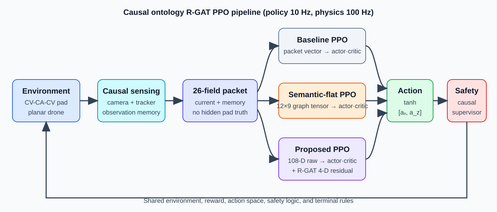

# 알고리즘 구성

## 요약

- 방법 구성: 환경 모델 → 센서 모델 → 추정기 → 관측 패킷 → (의미 그래프 구성) → 상태 표현 → 정책·가치 네트워크 → 안전 감독기 → 환경 모델의 폐루프
- 학습 절차·평가: 폐루프 외부의 비실시간 구성 요소
- 비교 설계: 상태 표현 3종만 상이, 나머지 구성 요소 전부 공통
- 정보 경계: 정책 입력은 causal 관측 패킷 $o_t$의 함수로 한정, 은닉 truth·미래 정보·보상·결과 라벨 제외
- 실제 상태 사용 범위: 동역학 적분·접촉 판정·보상·평가 지표
- 주기 구조: 정책·가치 순전파 $\Delta t_p=0.10$ s, 감독기·동역학·센서·추정기 $\Delta t_s=0.01$ s

## 1. 구성 요소 목록

- 핵심: 9개 구성 요소, 각 요소의 입력·출력은 기호 수준 인터페이스로 정의

| 구성 요소 | 입력 | 출력 | 주기 | 역할 |
|---|---|---|---|---|
| 환경 모델 | $\tilde a_k$, $w_{\theta,k}$, $\sigma$ | $\xi_{k+1}$, $(x_p,v_p,a_p)(t_{k+1})$, 종료 사건 | $\Delta t_s$ | 평면 기체 동역학·CV–CA–CV 패드 운동·접촉 판정 |
| 센서 모델 | $\xi_{k+1}$, $x_p(t_{k+1})$, $\delta_{k+1}$ | $d_k$, $\tilde e_{x,k}$, $\tilde\beta_k$, $c_k$ | $\Delta t_s$ | 기체 고정 카메라 투영·가시성·잡음·dropout |
| 추정기 | $d_k$, $\tilde e_{x,k}$, $x_k$, $v_{x,k}$, $c_k$ | $\hat\chi_k$, $\hat\sigma_p,\hat\sigma_v,\hat\sigma_a$, $\Delta t_{\mathrm{loss}}$ | $\Delta t_s$ | 등가속도 예측 + 이득 $k_p,k_v,k_a$ 보정 + innovation gate |
| 결정 문맥 | $\Delta t_{\mathrm{loss}}$, 마지막 수용 신뢰도 | $I^{inh}_k$, $I^{ab}_k$ | $\Delta t_s$ | 착륙 금지·abort 요청 플래그 갱신 |
| 관측 패킷 | $\xi_k$, $\hat\chi_k$, 측정, 플래그, $T_d-t$, $\bar a_{t-1}$ | $o_t\in\mathbb{R}^{26}$ | $\Delta t_p$ (감독기용 $\Delta t_s$) | own-state·추적·가시성·임무 기억 4그룹 구성 |
| 의미 그래프 구성 | $o_t$ | $X_t\in\mathbb{R}^{12\times9}$, $s_t=\mathrm{vec}(X_t)$ | $\Delta t_p$ | 9개 의미 노드 특징 산출, 고정 간선 구조 $\mathcal{G}$ |
| 상태 표현·정책·가치 | $o_t$ 또는 $s_t$ (+ $c_t$) | $\mu_t$, $\sigma_\pi$, $V_t$ | $\Delta t_p$ | Gaussian Actor·Critic 순전파 |
| 행동 사상 | $u_t$ | $\bar a_t$, $a_t$ | $\Delta t_p$ | $\tanh$ 유계화·축별 가속도 배율 |
| 안전 감독기 | $a_t$, $\xi_k$, $o_k$ | $\tilde a_k$ | $\Delta t_s$ | 하강 차단·정지 높이 제동·복구 backup |

## 2. 환경 모델

- 핵심: 실제 상태의 유일한 보유 구성 요소, 정책에는 센서·추정기를 거친 정보만 전달
- 입력: 감독기 적용 가속도 $\tilde a_k$, 외란 $w_{\theta,k}$, 시나리오 $\sigma\sim\mathcal{D}$
- 상태: $\xi_k$, 패드 궤적 $(x_p,v_p,a_p)(t)$, 외생 일정 $\mathcal{W}$
- 처리: $\tilde a_k\to(\theta^{sp},F^{sp})\to$ 2차 pitch 루프·1차 추력 지연 $\to$ 병진 적분
- 출력: $\xi_{k+1}$, 패드 상태, 종료 사건 (SUCCESS, SAFE_ABORT, TASK_TIMEOUT, UNSAFE_CONTACT, UNAUTHORIZED_CONTACT, MISSED_PAD_CONTACT, SAFETY_ENVELOPE_VIOLATION)
- 보상 산출: 결정 시작·종료 시점 실제 상태 기반 $r_t$, 학습 신호 전용

## 3. 센서 모델

- 핵심: 실제 상대 기하의 유일한 정책 측 통로, 시야각·거리·dropout에 의한 정보 단절 포함
- 입력: $e_x$, $h$, $\theta$ (실제값), dropout 지시자 $\delta_k$
- 출력: 검출 $d_k$, 잡음 측정 $\tilde e_{x,k},\tilde\beta_k$, 신뢰도 $c_k$
- own-state $\xi_k$: 잡음 없는 직접 측정 가정

## 4. 추정기

- 핵심: 비가시 구간의 패드 운동을 과거 측정만으로 외삽하는 causal 기억
- 입력: 검출·측정·자기 수평 위치·속도
- 출력: $\hat\chi=[\hat x_p,\hat v_p,\hat a_p]^\top$, 불확실성 $\hat\sigma_p,\hat\sigma_v,\hat\sigma_a$, 경과 시간 $\Delta t_{\mathrm{loss}}$
- 처리: 예측($\Delta$) → 불확실성 전파 → gate 판정($\nu_k$) → 수용 시 보정($\Delta t_m$) → 가속도 포화·감쇠($\tau_a$)
- 실제 패드 상태 참조 제외

## 5. 의미 그래프 구성

- 핵심: 동일 패킷 $o_t$의 결정론적 재배열·변환, 정보 추가 없는 의미 구조화
- 입력: $o_t$
- 출력: 노드 특징 $X_t\in\mathbb{R}^{12\times9}$, raw semantic 상태 $s_t\in\mathbb{R}^{108}$
- 그래프: $\mathcal{G}=(\mathcal{V},\mathcal{E},\mathcal{R})$, 노드 9개, 간선 26개(의미 17 + 자기 9), 관계 유형 5개
- 노드: PadVisibility, PadMotion, DroneTranslation, DroneAttitude, RelativeTracking, TrackingCorrection, ViewRecovery, DescentEligibility, LandingInhibit
- 관계 유형: informs, affects_visibility, supports, inhibits, self
- 읽기 그룹: Perception·Tracking·Vehicle·Safety

## 6. 상태 표현 3종

- 핵심: 동일 정보원 $o_t$에 대한 표현 방식만의 비교, 정책·가치 네트워크 구조·학습 규칙 공통

| 표현 | Actor 평균 $\mu_t$ | Critic $V_t$ | 입력 차원 |
|---|---|---|---:|
| Baseline | $f_\pi(\bar o_t)$ | $f_V(\bar o_t)$ | 26 |
| Semantic-flat | $f_\pi(s_t)$ | $f_V(s_t)$ | 108 |
| Ontology R-GAT | $f_\pi(s_t)+\tilde\delta_t$ | $f_V(s_t)+w_V^\top c_t$ | 108 + 4 |

- $\bar o_t$: 정규화 관측 패킷 — 신규 기호
- $f_\pi,f_V$: 은닉층 48×2 MLP
- 관계 문맥: $c_t\in\mathbb{R}^4$ = 관계 유형별 attention 1층으로 갱신한 노드 임베딩 $h_j\in\mathbb{R}^8$의 그룹 평균 $\bar h_g$ readout ($W_c,b_c$)
- 관계 residual: $\delta_t=W_\pi c_t$, 수평 성분 그대로, 수직 성분은 하강 방향($\delta_{t,z}<0$)일 때만 $g_t$ 배 축소

$$
\tilde\delta_{t,x}=\delta_{t,x},\qquad
\tilde\delta_{t,z}=\begin{cases}g_t\,\delta_{t,z}, & \delta_{t,z}<0\\ \delta_{t,z}, & \delta_{t,z}\ge0\end{cases}
$$

- $g_t=\mathrm{clip}(\cdot,0,1)$: DescentEligibility 노드 primary 특징
- 상승·제동 방향 관계 보정: 억제 제외
- Actor·Critic: 별도 인코더 파라미터 보유

## 7. 정책·가치 네트워크와 행동 사상

- 핵심: Gaussian 원시 행동의 $\tanh$ 유계화, likelihood는 원시 행동 기준
- Actor: $u_t\sim\mathcal{N}(\mu_t,\mathrm{diag}(\sigma_\pi^2))$, 평가 시 $u_t=\mu_t$
- 행동 사상: $\bar a_t=\tanh(u_t)$, $a_t=\mathrm{diag}(a_{x,\max},a_{z,\max})\,\bar a_t$
- Critic: $V_t$, 종료 이후 bootstrap 0
- 출력 유지: 결정 구간 $\Delta t_p$ 동안 $a_t$ 고정

## 8. 안전 감독기

- 핵심: 모든 비교 대상 공통의 causal 결정 규칙 $\Pi_s$, 학습 대상 아님
- 입력: 요청 가속도 $a_t$, own-state $\xi_k$, 물리 step 단위 패킷 $o_k$
- 출력: 적용 가속도 $\tilde a_k$
- 분기: abort 요청 시 복구 backup → 착륙 금지 시 하강 차단·제동 → 정지 높이 $h_{stop}$ 미달 시 수직 제동 → 통과
- 결정 문맥 $I^{inh},I^{ab}$: 추정기 출력만으로 갱신, 관측 패킷 임무 기억 그룹으로 정책에 공개

## 9. 학습 절차

- 핵심: 무작위 초기화 정책의 순수 PPO, 학습 전용 커리큘럼, 검증 분할 기반 checkpoint 선택
- 단계 1 — 그래프 사전학습 (R-GAT 전용): $\mathcal{S}_{tr}$ 일부 에피소드의 무작위 행동 방문 상태에서 동시각 노드 특징 masked 재구성, 정적 backbone 이후 고정
- 단계 2 — PPO: 반복마다 커리큘럼 난이도 $\ell$ 적용 에피소드 수집 → GAE($\lambda$, $\gamma_{\Delta t}$) 기반 $\hat A_t$ → clip 비율 $\epsilon$ 목적함수 갱신
- 단계 3 — 관계 경로 학습 (R-GAT 전용): 전체 반복 후반부에서만 관계 경로 갱신, raw 경로 보존
- 단계 4 — checkpoint 선택: $\ell=1$ 이후 검증 분할 평가 점수 $J$ 최대 정책 채택
- 단계 5 — 관계 경로 가드 (R-GAT 전용): raw 정책 고정 관계 전용 미세조정 → 축소 배율 $\nu_{rel}$ 내림차순 탐색 → 검증 성능 비저하 첫 배율 채택
- 학습 입력: $(s_t\text{ 또는 }\bar o_t,\;u_t,\;\log\pi_\theta(u_t\mid s_t),\;r_t,\;\Delta t)$
- 학습 출력: Actor·Critic·인코더 파라미터

## 10. 평가

- 핵심: 결정론적 정책의 공칭 분포 평가, 검증·시험 분할 분리
- 입력: 고정 파라미터 정책, 시험 분할 $\mathcal{S}_{te}$ (공칭 시나리오·센서 설정)
- 출력: 결과율 $p_s,p_u,p_a,p_\tau$, 비할인 평균 return $\bar G$, 안정성 지수 $SI$, authority margin $m_v,m_a,m_T$
- 비교 대상 간 동일 seed의 시나리오·센서 사건·측정 잡음 공유 (쌍대 비교)
- 대표 시나리오 S1–S3: 성능 확인 이전 고정

## 11. 데이터 흐름

- 핵심: 실제 상태 → 센서 → 추정기 → 패킷 → 정책의 단방향 정보 흐름, 실제 상태의 정책 직접 유입 경로 부재

| 출발 | 도착 | 전달 정보 | 주기 |
|---|---|---|---|
| 환경 모델 | 센서 모델 | 실제 상대 기하 $(e_x,h,\theta)$ | $\Delta t_s$ |
| 외생 일정 $\mathcal{W}$ | 센서 모델·환경 모델 | $\delta_k$, $w_{\theta,k}$ | $\Delta t_s$ |
| 센서 모델 | 추정기 | $d_k,\tilde e_{x,k},\tilde\beta_k,c_k$ | $\Delta t_s$ |
| 추정기 | 결정 문맥·관측 패킷 | $\hat\chi_k$, 불확실성, $\Delta t_{\mathrm{loss}}$ | $\Delta t_s$ |
| 환경 모델 | 관측 패킷 | own-state $\xi_k$ (이상 측정) | $\Delta t_s$ |
| 관측 패킷 | 의미 그래프 구성·상태 표현 | $o_t$ | $\Delta t_p$ |
| 의미 그래프 구성 | 상태 표현 | $X_t$, $s_t$ | $\Delta t_p$ |
| 정책 네트워크 | 행동 사상 | $u_t$ | $\Delta t_p$ |
| 행동 사상 | 안전 감독기 | $a_t$ | $\Delta t_p$ (유지) |
| 관측 패킷 | 안전 감독기 | $o_k$ | $\Delta t_s$ |
| 안전 감독기 | 환경 모델 | $\tilde a_k$ | $\Delta t_s$ |
| 환경 모델 | 학습 절차 | $r_t$, 종료 사건 | $\Delta t_p$ |

## 12. 인과성 제약

- 핵심: 정책·감독기·그래프의 입력은 시점 $t$까지의 측정과 own-state의 함수로 한정

- 정책 입력 허용: 현재 own-state, 현재 검출 결과, causal 추정 $\hat\chi$, 검출 경과 시간·불확실성, 직전 행동, 감독기 공개 플래그, 잔여 임무 시간
- 정책 입력 금지: 비가시 시점의 실제 패드 위치·속도·가속도
- 정책 입력 금지: 시나리오 구간 번호(CV/CA/CV phase)와 미래 패드 궤적
- 정책 입력 금지: 외생 일정 $\mathcal{W}$ (dropout·외란 예정 시각)
- 정책 입력 금지: 보상·return·advantage·종료 결과 라벨
- 측정 시점 제약: 접촉·종료 사건 이후 측정의 추정기 유입 차단
- 그래프 사전학습 제약: 동시각 패킷 기반 특징만 재구성 대상, 행동·보상·결과·미래 표본·실제 상태 미사용
- 분할 제약: 사전학습 $\mathcal{S}_{tr}$, 선택 $\mathcal{S}_{val}$, 보고 $\mathcal{S}_{te}$의 상호 배타, 시험 분할 기반 선택 제외
- 학습 커리큘럼 제약: 학습 에피소드 생성에만 적용, 검증·시험은 공칭 설정 고정

## 13. Simulink 구현

- 핵심: §1의 구성 요소를 같은 주기의 Simulink 블록으로 배치, 블록은 같은 환경 함수 호출
- 환경 모델·센서 모델·추정기·결정 문맥·안전 감독기: $\Delta t_s$ MATLAB System 블록
- 관측 패킷·의미 그래프 구성·보상: $\Delta t_p$ 결정 출력 블록
- 정책·가치 네트워크: RL Toolbox `RL Agent` 블록 (`rlPPOAgent`)
- 상세: [Simulink 실행·학습](SIMULINK_KO.md)

## 14. 3차원 확장 옵션

- 핵심: `spatialDimension=3`에서 §1의 구성 요소에 측방 $y$축·roll 축 추가, 세 비교군 공통
- 동역학: `dynamics.stepSpatial`·`dynamics.accelerationToAttitude` (pitch·roll 2차 루프)
- 패드 궤적: `scenario.padState` (진행 방향·측방 CV–CA–CV)
- 센서·추정기: 원뿔 시야 `sensing.projectPad`, 측방 추정 채널 `sensing.updatePadTrack`
- 관측·그래프: 37차원 packet, 노드 특징 14채널, R-GAT 수직 gate는 마지막 행동 성분
- 상세: [3차원 확장 옵션](SPATIAL_3D_KO.md)
