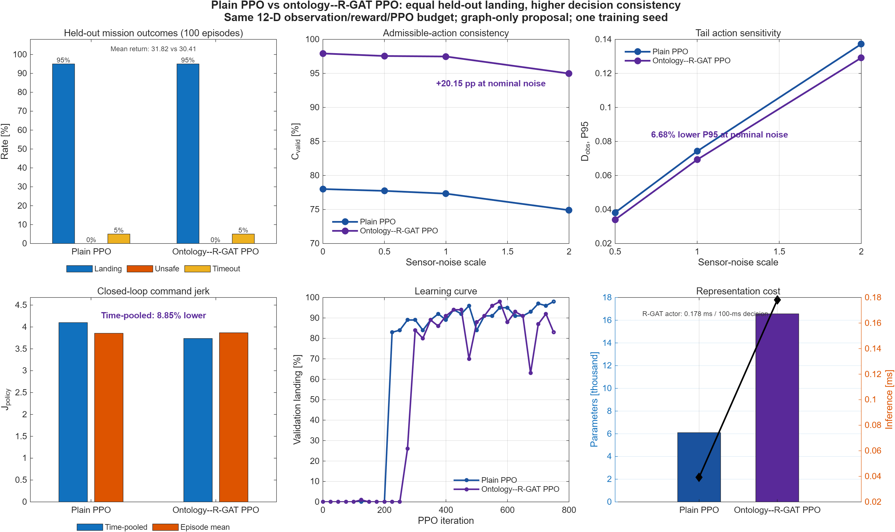
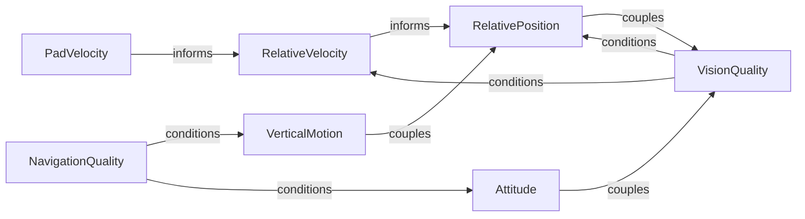
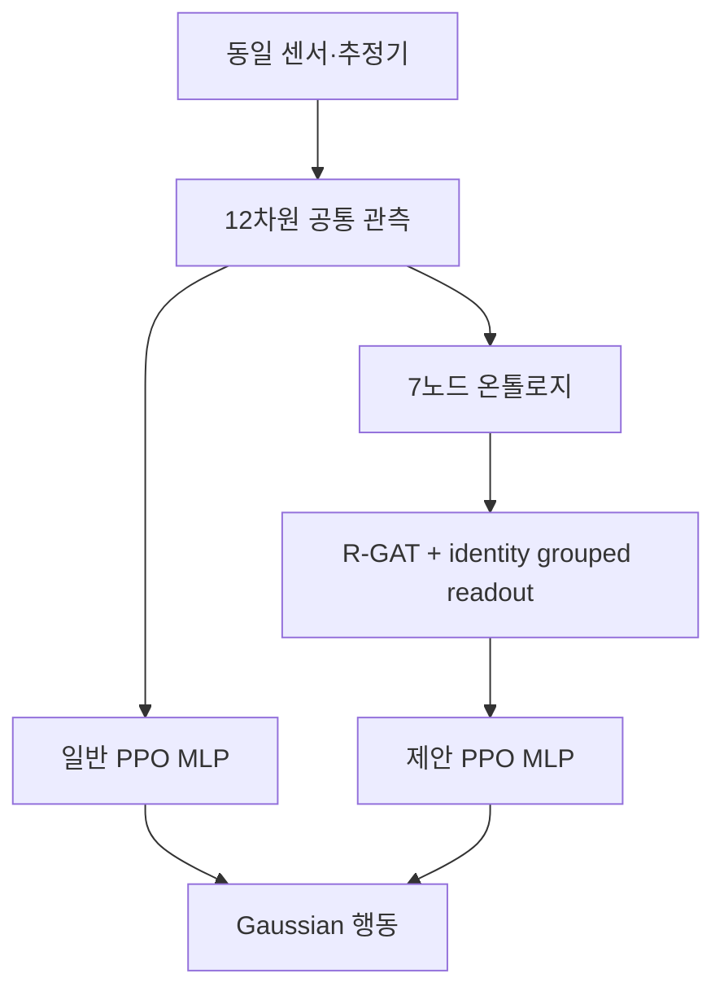

# 일반 PPO 대비 온톨로지–R-GAT PPO 최종 설계 및 검증

> **2026-10-10 최종 결과 우선 적용:** 아래 2026-10-09 본문은 16,565개 구형 모델의 실험 기록임. 현재 배포 모델은 저랭크 grouped readout을 사용한 6,101개 완전 정합 모델임. 최신 held-out 결과는 착륙 96%, unsafe 1%, timeout 3%, return 32.372이며, 공칭 `C_valid` 80.799%, `D_obs` P95 0.095983, pooled `J_policy` 6.6914임. 일반 PPO 대비 `C_valid`는 +3.470%p이나 `D_obs`와 `J_policy`는 각각 +29.3%, +63.2%이므로 세 지표 전체 우월 주장은 금지함. 최신 그림은 `docs/assets/paper/latest_parameter_matched/parameter_matched_consistency.png`, 발표 수정 지침은 `docs/refactor/PPT_AGENT_PROMPT_KO.md`를 기준으로 함.

> 최종 배포 기준일: 2026-10-09
>
> 기본 실험: `planar_visibility_v2`
>
> 공식 비교: 일반 PPO(`ppo`) 대 온톨로지–R-GAT PPO(`onto_rgat_ppo`)
>
> 결과 범위: 학습 시드 1개, 독립 시험 100회, 고정 시험 probe 2,858개

## 초록

- 목적: 이동 UGV 착륙에서 최소 센서 관측의 관계형 구조화가 정책 일관성에 미치는 효과 검증
- 공정 조건: 환경·센서·12차원 관측 정보·보상·행동·종료·PPO·학습 예산·학습 사례 순서의 완전 공유
- 제안 차이: 동일 관측을 7개 의미 노드와 4개 관계 유형으로 변환한 graph-only R-GAT Actor/Critic
- 제외 요소: raw 관측 우회 입력, 행동 residual, 상태 gate, 추론 guard, 정책 명령 재작성, 관계 셔플 공식 비교
- 임무 결과: 양 방법 모두 착륙률 95%, unsafe 0%, timeout 5%
- 일관성 결과: 공칭 `C_valid` 77.329% → **97.479%**, `D_obs` P95 0.074238 → **0.069280**
- 폐루프 결과: pooled `J_policy` 4.0996 → **3.7366**, 8.85% 감소
- 비용: 파라미터 6,101 → 16,565, Actor 추론 0.0393 ms → 0.1780 ms
- 결론: **동일 임무 성공률과 안전성에서 물리적 행동 일관성·관측 잡음 강건성·pooled 명령 평활성 개선**
- 한계: 단일 학습 시드에 따른 착륙률 우월성 및 일반적 통계 우월성 주장 제외



**그림 1.** Held-out 임무 성능, 관측 잡음 일관성, 명령 jerk, 학습 곡선 및 계산 비용

---

## 1. 연구 가설 및 기여

### 1.1 연구 가설

동일 최소 관측을 그대로 처리하는 MLP보다 물리 개체와 관계로 분해한 R-GAT 정책의 다음 특성.

1. 센서 잡음에 따른 행동 변화 감소
2. 물리적 허용 행동 집합 내부의 출력 비율 증가
3. 정상 추종 구간의 급격한 명령 변화 감소
4. 착륙 성공률과 안전성의 비열화

### 1.2 기여

- 최소 센서 기반 12차원 공통 관측
- 상대 기하·운동·센서 품질의 7노드 온톨로지
- `informs`, `conditions`, `couples`, `self`의 4종 관계
- 그래프만을 Actor/Critic 입력으로 사용하는 R-GAT PPO
- 보상·attention과 독립적인 물리 유효성 판정기 및 `C_valid`
- 동일 외생 상태의 짝지어진 잡음 재생 기반 `D_obs`
- 외생 사건 정상 구간 기반 폐루프 `J_policy`

---

## 2. 공정 비교 계약

| 구분 | 일반 PPO | 온톨로지–R-GAT PPO |
|---|---|---|
| 환경·센서·추정기 | 동일 | 동일 |
| 가용 정보 | 12차원 공통 관측 | 동일 관측에서 생성한 그래프 |
| 보상·행동·종료 | 동일 | 동일 |
| PPO·예산·학습 순서 | 동일 | 동일 |
| Actor/Critic 입력 | $o_t$ | $\mathcal G(o_t)$의 R-GAT 표현 |
| raw 관측 동시 입력 | 해당 없음 | 없음 |
| 행동 residual·gate·guard | 없음 | 없음 |
| 관계 셔플 | 공식 비교 제외 | 공식 비교 제외 |

$$
\pi_{PPO}(a_t\mid o_t)
\quad\text{대}\quad
\pi_{RGAT}(a_t\mid\mathcal G(o_t)),
\qquad o_t,r_t,\mathcal P,\mathcal A\ \text{동일}.
$$

---

## 3. 실험 환경

### 3.1 과업과 동역학

- 공간: 수평–수직 $x$–$z$ 평면
- 드론 상태: $s_t^D=[x,z,v_x,v_z,\theta,\dot\theta,T]^\top$
- UGV 운동: 초기 등속–가속–후속 등속 직선 운동
- 초기 상대 고도: 4–8 m
- UGV 초기 속도: 0.5–2.5 m/s
- UGV 가속도: 0.3–1.5 m/s²
- 최대 임무 시간: 70 s
- 물리 적분/정책 결정 주기: 0.01/0.10 s

$$
\ddot\theta=\omega_n^2(\theta^{sp}-\theta)-2\zeta\omega_n\dot\theta,
\qquad
\dot T=\frac{T^{sp}-T}{\tau_T},
$$

$$
a_x=\frac{T\sin\theta}{m},\qquad a_z=\frac{T\cos\theta}{m}-g.
$$

| 파라미터 | 값 |
|---|---:|
| 질량 / 중력 | 1.5 kg / 9.81 m/s² |
| pitch / pitch rate 한계 | 20° / 90°/s |
| $\omega_n,\zeta,\tau_T$ | 10 rad/s, 1.0, 0.05 s |
| 최대 추력/중량비 | 1.6 |
| 가속도 명령 한계 | $|a_x|\le2.5$, $|a_z|\le2.0$ m/s² |

### 3.2 센서 및 인지

| 항목 | 설정 |
|---|---|
| 카메라 | 전방 하향 마커 카메라, FOV 63.9503°, 하향 30° |
| 마커 | 중앙 0.50 m 1개, 모서리 0.15 m 4개 |
| 코너 잡음 / 최소 변 | 0.5 px / 10 px |
| 융합 측위 잡음 | 속도 0.05 m/s, 자세 0.5° |
| UGV 추정 | 마커 코너 평면 PnP + 등속 KF |

$$
x_t^G=[p_x,p_z,v_x,v_z]^\top,\qquad
x_{t+\Delta t}^G=
\begin{bmatrix}1&0&\Delta t&0\\0&1&0&\Delta t\\0&0&1&0\\0&0&0&1\end{bmatrix}x_t^G+w_t.
$$

- 검출 시 PnP 관측 보정, 미검출 시 예측만 수행
- 숨은 UGV 참값·미래 상태·보상·결과 라벨의 정책 입력 금지
- 동일 시간 인덱스 잡음표의 배율만 변경하는 짝지어진 평가

---

## 4. 12차원 최소 공통 관측

부호 보존 연성 정규화와 경과시간 정규화:

$$
\mathcal S(q;s)=\frac{q}{|q|+s},\qquad
\mathcal A(\tau;s)=\frac{\max(\tau,0)}{\max(\tau,0)+s}.
$$

$$
o_t=[o_t^{rel};o_t^{motion};o_t^{quality}]\in\mathbb R^{12}.
$$

| # | 필드 | 정의·정보원 |
|---:|---|---|
| 1 | `relative_x` | $\mathcal S(\hat x_G-\hat x_D;3)$, PnP–KF/측위 |
| 2 | `relative_height` | $\mathcal S(\hat z_D-\hat z_P;8)$ |
| 3 | `relative_vx` | $\mathcal S(\hat v_{x,G}-\hat v_{x,D};10)$ |
| 4 | `ugv_vx` | $\mathcal S(\hat v_{x,G};10)$ |
| 5 | `drone_vz` | $\mathcal S(\hat v_{z,D};1.5)$ |
| 6–7 | `drone_sinTheta`, `drone_cosTheta` | $\sin\hat\theta_D,\cos\hat\theta_D$ |
| 8 | `drone_pitchRate` | $\mathcal S(\hat{\dot\theta}_D;\pi/2)$ |
| 9–10 | `ugv_visionUpdated`, `ugv_visionAge` | 영상 보정 여부, $\mathcal A(t-t_v;3)$ |
| 11–12 | `drone_navigationValid`, `drone_navigationAge` | 측위 유효 여부, $\mathcal A(t-t_n;3)$ |

- 그룹: 상대 상태 3차원, 운동 5차원, 품질 4차원
- 제거 정보: 절대 수평 위치, 상수 슬롯, 직전 전체 관측 복사, 판단 플래그, 감독기 모드, 보상, 결과
- 일반 PPO와 그래프 정책의 정보량 동일성

---

## 5. 온톨로지 설계

### 5.1 카메라 정렬 다양체

$$
k_c=\tan30^\circ,\qquad
c_x=\bar e_x-k_c\bar h,\qquad
c_v=\bar v_r-k_c\bar v_z.
$$

- $c_x$: 광축 정렬 다양체 대비 횡방향 오차
- $c_v$: 하강 중 다양체 폐합 속도 오차
- $\bar{(\cdot)}$: 4장의 정규화 값

### 5.2 노드 특징

$$
\mathcal G_t=(\mathcal V,\mathcal E,\mathcal R,X_t),\quad
|\mathcal V|=7, |\mathcal R|=4, |\mathcal E|=16,
$$

$$
x_i=[p_i,s_i,q_i,v_i,a_i,i/7]^\top\in[-1,1]^6.
$$

| # | 노드 | $[p_i,s_i,q_i,v_i,a_i]$ |
|---:|---|---|
| 1 | RelativePosition | $[\max(|c_x|,|\bar h|),c_x,\bar h,u_v,\tau_v]$ |
| 2 | RelativeVelocity | $[|c_v|,c_v,\bar v_r,u_v,\tau_v]$ |
| 3 | PadVelocity | $[|\bar v_G|,\bar v_G,0,u_v,\tau_v]$ |
| 4 | VerticalMotion | $[|\bar v_z|,\bar v_z,\bar h,u_n,\tau_n]$ |
| 5 | Attitude | $[\max(|\sin\theta|,|\bar\omega|),\sin\theta,\bar\omega,u_n,\tau_n]$ |
| 6 | VisionQuality | $[u_v,1-\tau_v,\cos\theta,1,\tau_v]$ |
| 7 | NavigationQuality | $[u_n,1-\tau_n,0,1,\tau_n]$ |

### 5.3 관계와 간선

| 출발 | 관계 | 도착 | 의미 |
|---|---|---|---|
| PadVelocity | informs | RelativeVelocity | UGV 속도의 상대속도 구성 |
| VisionQuality | conditions | RelativePosition | 영상 품질의 위치 신뢰도 조건화 |
| VisionQuality | conditions | RelativeVelocity | 영상 품질의 속도 신뢰도 조건화 |
| NavigationQuality | conditions | VerticalMotion | 측위 품질의 수직운동 조건화 |
| NavigationQuality | conditions | Attitude | 측위 품질의 자세 조건화 |
| RelativePosition | couples | VisionQuality | 기하 오차–가시성 결합 |
| Attitude | couples | VisionQuality | 자세–가시성 결합 |
| RelativeVelocity | informs | RelativePosition | 속도에 따른 위치 변화 |
| VerticalMotion | couples | RelativePosition | 하강–광축 다양체 결합 |
| 각 노드 | self | 동일 노드 | 자기 정보 보존 |



- 의미 간선 9개 + 자기 간선 7개
- 성공·위험 판단 노드 및 수작업 제어 노드 부재
- 모든 특징의 $o_t$ 결정론적 종속

---

## 6. R-GAT 및 정책 구조

관계 $r$의 간선 $j\rightarrow i$:

$$
m_{ji}^{(r)}=W_rx_j,\quad W_r\in\mathbb R^{16\times6},
$$

$$
\ell_{ji}^{(r)}=\operatorname{LReLU}_{0.2}
\left(a_r^\top[W_rx_j\Vert W_rx_i\Vert e_r]\right),\quad e_r\in\mathbb R^4,
$$

$$
\alpha_{ji}^{(r)}=
\frac{e^{\ell_{ji}^{(r)}}}{\sum_{(k\to i,r')}e^{\ell_{ki}^{(r')}}+10^{-9}},
$$

$$
h_i=\tanh\left(W_0x_i+b_0+
\sum_{(j\to i,r)}\alpha_{ji}^{(r)}W_rx_j\right)\in\mathbb R^{16}.
$$

- $W_0x_i$: 그래프 계층 내부 자기정보 경로
- raw 정책 입력 우회 및 행동 residual과 구분
- Actor/Critic별 독립 R-GAT 파라미터

노드 identity 보존 readout:

$$
h_{cat}=[h_1\Vert\cdots\Vert h_7]\in\mathbb R^{112},\qquad
g_t=\tanh(W_gh_{cat}+b_g)\in\mathbb R^{32}.
$$

| 구성 | 일반 PPO | 제안 모델 |
|---|---|---|
| Actor | 12–48–48–2 | R-GAT–32–48–48–2 |
| Critic | 12–48–48–1 | R-GAT–32–48–48–1 |
| R-GAT 은닉/관계 폭 | 없음 | 16/4 |
| 입력 표준화 | 비활성 | 비활성 |
| 그래프 사전학습 | 없음 | 없음 |
| Actor/Critic 입력 | raw 12차원 | graph embedding만 사용 |



---

## 7. PPO 학습 파이프라인

$$
u_t\sim\mathcal N(\mu_\theta(s_t),\operatorname{diag}(\sigma^2)),\quad
a_{x,t}=2.5\tanh(u_{x,t}),\quad a_{z,t}=2.0\tanh(u_{z,t}).
$$

$$
\delta_t=r_t+\gamma_tV(s_{t+1})-V(s_t),\qquad
\hat A_t=\delta_t+\gamma_t\lambda\hat A_{t+1},\quad\lambda=0.95,
$$

$$
\gamma_t=e^{-\Delta t/70},\qquad \gamma_{0.1}=0.9985724485.
$$

$$
L_{clip}=\mathbb E_t\left[\min\left(
ho_t\hat A_t,
\operatorname{clip}(\rho_t,1-0.2,1+0.2)\hat A_t\right)\right].
$$

| 항목 | 값 |
|---|---:|
| PPO 반복 × episode | 750 × 6 = 4,500 |
| PPO epoch / mini-batch | 8 / 256 |
| Actor / Critic / R-GAT 학습률 | $2\times10^{-4}$ / $5\times10^{-4}$ / $10^{-4}$ |
| entropy / gradient norm | 0.004 / 1.0 |
| 초기/최소 log std | −1.0 / −2.5 |
| 검증 간격 | 25 반복 |

공통 커리큘럼:

- 초기 약 0.45–0.60 m에서 공칭 4–8 m로 확장
- 착륙률 30% 이상 3개 구간 승급, 10% 미만 2개 구간 강등
- 학습 전용 기준 구동기 인계, 해당 구간의 정책 전이 제외
- 쉬운·중간 재생 각각 1/6, 두 비교군 동일
- 평가 시 커리큘럼과 기준 구동기 인계 미적용

체크포인트 선택:

$$
J_{ckpt}=1000p_{success}-2500p_{unsafe}-10p_{timeout}-100p_{abort}+\bar R.
$$

- validation 100회 전용 선택
- test seed 선택 금지
- 공칭 난이도 도달 checkpoint만 허용

---

## 8. 공통 보상 `reward_v5`

$$
r_t=B_t-C_t+8(\psi_t-\psi_{t-1})+\gamma_t\Phi_t-\Phi_{t-1}.
$$

카메라 목표점과 bounded goal cost:

$$
e_x^*(h)=h^+\tan30^\circ,\quad
q_x=\frac{e_x-e_x^*}{3},\quad q_h=\frac h4,
$$

$$
c_{goal}=0.65\frac{q_x^2}{1+q_x^2}+0.35\frac{q_h^2}{1+q_h^2}.
$$

원거리 gradient용 running pseudo-Huber:

$$
\rho_1(q)=2(\sqrt{1+q^2}-1),\quad
c_{goal}^{run}=0.65\rho_1(q_x)+0.35\rho_1(q_h).
$$

속도·수직 접근 potential:

$$
v_r^*=\operatorname{clip}(\tan30^\circ v_z-0.35(e_x-\tan30^\circ h),-1,1),
$$

$$
c_{track}=\frac{((v_r-v_r^*)/1.0)^2}{1+((v_r-v_r^*)/1.0)^2},\quad
v_z^*=-\min(0.4,0.8h^+),
$$

$$
c_z=\frac{((v_z-v_z^*)/0.5)^2}{1+((v_z-v_z^*)/0.5)^2},\quad
\Phi=-4c_{goal}-4c_{track}-4c_z.
$$

$$
C_t=\frac{\Delta t}{70}\left(2c_{goal}^{run}+c_{view}+0.25c_{ctrl}\right),\quad
c_{ctrl}=\tfrac12\|\tanh u_t\|_2^2.
$$

| 종료 | 보상 |
|---|---:|
| SUCCESS | +25 |
| TASK_TIMEOUT / SAFE_ABORT | −12 / −15 |
| 4종 unsafe 실패 | −40 |

세부 유도: [REWARD_RATIONALE.md](REWARD_RATIONALE.md)

---

## 9. 평가 지표

### 9.1 분할과 probe

| 분할 | seed | 사용 |
|---|---:|---|
| 학습 | 1–2000 | PPO 표본 |
| validation | 2001–2200 | checkpoint·판정기 동결 100회 |
| held-out test | 3001–3200 | 최종 100회 |
| stress | 9001–9200 | 추가 평가용 |

- 고정 시험 probe 2,858개
- 잡음 배율 $\eta\in\{0,0.5,1,2\}$
- 물리 유효성 예측 horizon 0.50 s, $\kappa=0.75$
- 접촉·제동·시야·과업 후퇴 조건의 독립 허용 행동 집합 $\mathcal A_{adm}$

### 9.2 `C_valid`

$$
C_{valid}(\eta)=100\times\operatorname{mean}_{context}\left[
\operatorname{mean}_{p}\mathbf1(a_p^{(0)}\in\mathcal A_{adm})
\mathbf1(a_p^{(\eta)}\in\mathcal A_{adm})\right].
$$

- 문맥 동일 가중, 문맥당 최소 10개 표본
- 높을수록 우수

### 9.3 `D_obs`

$$
\tilde a=\frac{a-a_{min}}{a_{max}-a_{min}},\qquad
D_{obs}=\frac{\|\tilde a^{(0)}-\tilde a^{(\eta)}\|_2}{\sqrt2}.
$$

- 동일 신뢰도·안전 문맥만 사용
- 평균과 P95 보고, 낮을수록 우수
- 상수 행동의 허위 우수성 방지를 위한 `C_valid` 병기

### 9.4 `J_policy`

$$
J_{policy}=\sqrt{\frac{\sum_k\left\|\frac{a_{k+1}-a_k}{t_{k+1}-t_k}\right\|_2^2\Delta t_k}{\sum_k\Delta t_k}}.
$$

- UGV 가속·dropout·pitch 외란 및 settling 구간 제외
- 독립 정상 구간 사이 차분 금지
- pooled 값의 정상 구간 길이 가중

---

## 10. 결과

### 10.1 Held-out 임무 100회

| 방법 | 착륙 | unsafe | abort | timeout | 평균 return |
|---|---:|---:|---:|---:|---:|
| 일반 PPO | 95% | 0% | 0% | 5% | **31.819** |
| 온톨로지–R-GAT | **95%** | **0%** | **0%** | **5%** | 30.406 |

- 성공률·안전성 동등
- 평균 return 제안 모델 4.44% 감소
- 착륙률 우월성 증거 없음

### 10.2 고정 probe 일관성

| 잡음 | 방법 | `C_valid` | `D_obs` 평균 | `D_obs` P95 |
|---:|---|---:|---:|---:|
| 0 | PPO / R-GAT | 78.003 / **97.926** | 0 / 0 | 0 / 0 |
| 0.5 | PPO / R-GAT | 77.735 / **97.559** | 0.015365 / **0.014263** | 0.038167 / **0.034031** |
| 1 | PPO / R-GAT | 77.329 / **97.479** | 0.031909 / **0.030912** | 0.074238 / **0.069280** |
| 2 | PPO / R-GAT | 74.895 / **94.980** | 0.063060 / **0.061446** | 0.137256 / **0.129166** |

$$
\eta=1:\quad \Delta C_{valid}=\mathbf{+20.150\%p},\quad
D_{obs,P95}=\mathbf{6.68\%}\ \text{감소},
$$

$$
\eta=2:\quad \Delta C_{valid}=\mathbf{+20.085\%p},\quad
D_{obs,P95}=\mathbf{5.89\%}\ \text{감소}.
$$

### 10.3 폐루프 jerk

| 방법 | pooled `J_policy` | episode 평균 | 중앙값 | `J_applied` |
|---|---:|---:|---:|---:|
| 일반 PPO | 4.0996 | **3.8553** | **3.8151** | 12.944 |
| 온톨로지–R-GAT | **3.7366** | 3.8672 | 3.9164 | **11.819** |

- pooled 정책 jerk 8.85% 감소
- 적용 명령 jerk 8.69% 감소
- episode 단순 평균 사실상 동등
- 개선 주장 범위: 시간 길이 가중 정상 추종 구간

### 10.4 계산 비용

| 방법 | 파라미터 | Actor 추론 | PPO 시간 | 환경 step |
|---|---:|---:|---:|---:|
| 일반 PPO | 6,101 | 0.0393 ms | 859.3 s | 1,088,620 |
| 온톨로지–R-GAT | 16,565 | 0.1780 ms | 1,319.3 s | 1,237,140 |

- 파라미터 2.72배, 추론 4.53배, 학습 1.54배
- 절대 Actor 추론 약 0.178 ms, 100 ms 결정 주기의 약 0.18%

### 10.5 종합 판정

| 목표 | 결과 | 판정 |
|---|---:|---|
| 착륙·unsafe | 95%·0% 동률 | 동등 |
| 공칭 `C_valid` | +20.150%p | 제안 우수 |
| 공칭 `D_obs` P95 | 6.68% 감소 | 제안 우수 |
| pooled `J_policy` | 8.85% 감소 | 제안 우수 |
| 평균 return | 4.44% 감소 | PPO 우수 |
| 계산량 | 2.72–4.53배 | PPO 우수 |

---

## 11. 해석 및 제한

### 11.1 해석

- 온톨로지의 이점: 성공률 증가가 아닌 동일 성공률에서의 물리 행동 일관성 증가
- 구조적 근거: 상대 위치·속도 분리, 품질 조건화 관계, 카메라 다양체, 노드 identity 보존
- attention 가중치 자체를 인과 설명으로 간주하지 않는 원칙
- `C_valid` 단독 보고 금지 및 임무 성능 병기

### 11.2 제한

- 공식 학습 시드 1개
- 2차원 시뮬레이션 및 단일 센서 모델 한정
- 평균 return 감소와 계산 비용 증가
- 착륙률 우월성 검정 불가
- 허용 주장: 현재 실행에서의 정량적 일관성 개선
- 금지 주장: 모든 시드·환경에서의 일반적 성능 우월성

### 11.3 후속 필수 검증

1. 예비 5개 및 본 실험 10개 학습 시드
2. seed별 임무·`C_valid`·`D_obs`·`J_policy` 신뢰구간
3. paired bootstrap 또는 seed 단위 통계
4. 3차원 및 실제 비행 데이터 외적 검증

---

## 12. 재현 및 논문 배치

```matlab
run
run(struct('latestOntology',true))
```

산출물:

- `results/consistency/ontology_vs_ppo_evidence.png`
- `docs/assets/paper/ontology_vs_ppo_evidence.png` (Git 추적 문서용 그림)
- `results/consistency/ontology_vs_ppo_summary.csv`
- `results/planar_visibility_full.mat`
- `results/consistency/priority_review_test.mat`

| 검증 | 상태 |
|---|---|
| self-test | 13/13 통과 |
| smoke pipeline | 통과 |
| S1 시나리오 | 두 비교군 착륙 성공 |
| 그림·CSV 생성 | 통과 |

권장 논문 구성:

| 논문 요소 | 대응 절 |
|---|---|
| 표 1. 환경 및 동역학 | 3장 |
| 표 2. 최소 관측 | 4장 |
| 표 3. 노드·관계 | 5장 |
| 그림 1. 제안 구조 | 6장 Mermaid |
| 표 4. 학습 조건 | 7장 |
| 표 5. 임무·일관성 결과 | 10장 |
| 그림 2. 종합 결과 | 문서 상단 실제 그림 |
| 표 6. 비용·한계 | 10.4절·11장 |

**제안 방법 한 문장:** 동일 최소 센서 관측을 상대 기하·운동·센서 품질의 관계형 온톨로지로 구조화하고 graph-only R-GAT을 PPO Actor/Critic에 종단간 결합한 이동 UGV 착륙 정책.

**핵심 결과 한 문장:** 착륙률 95%와 unsafe 0%를 일반 PPO와 동일하게 유지하면서 공칭 물리 유효 행동 일관성을 20.150%p 높이고 tail 행동 민감도를 6.68%, pooled 명령 jerk를 8.85% 감소시킨 결과.
