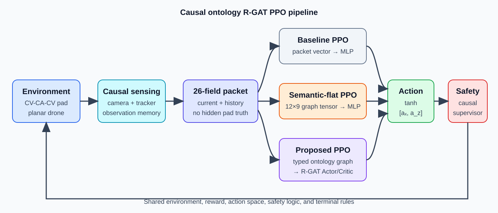
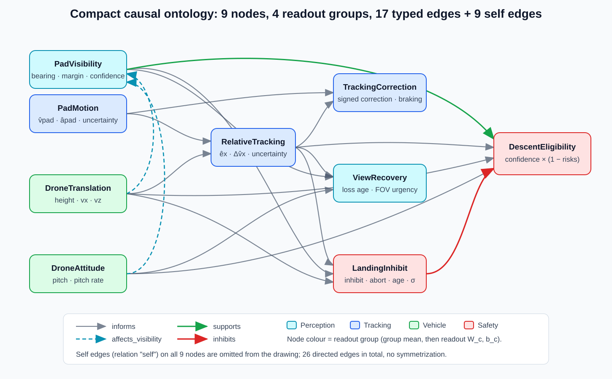
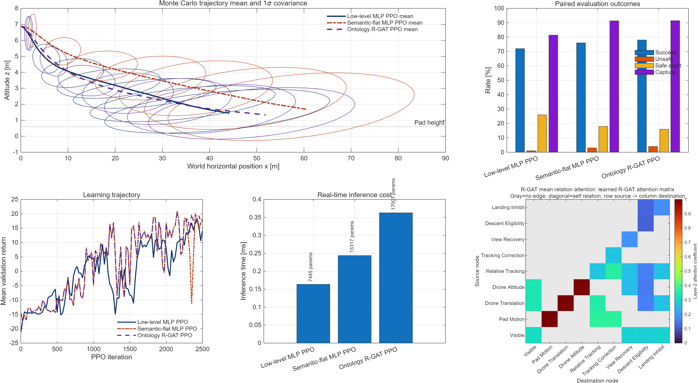
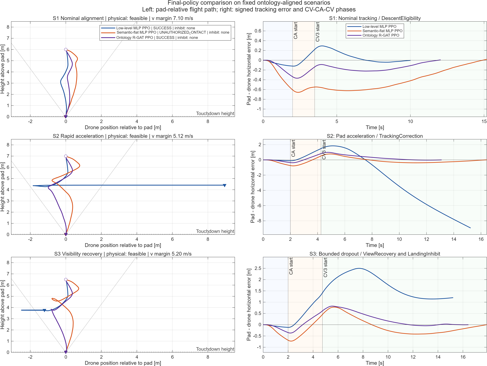
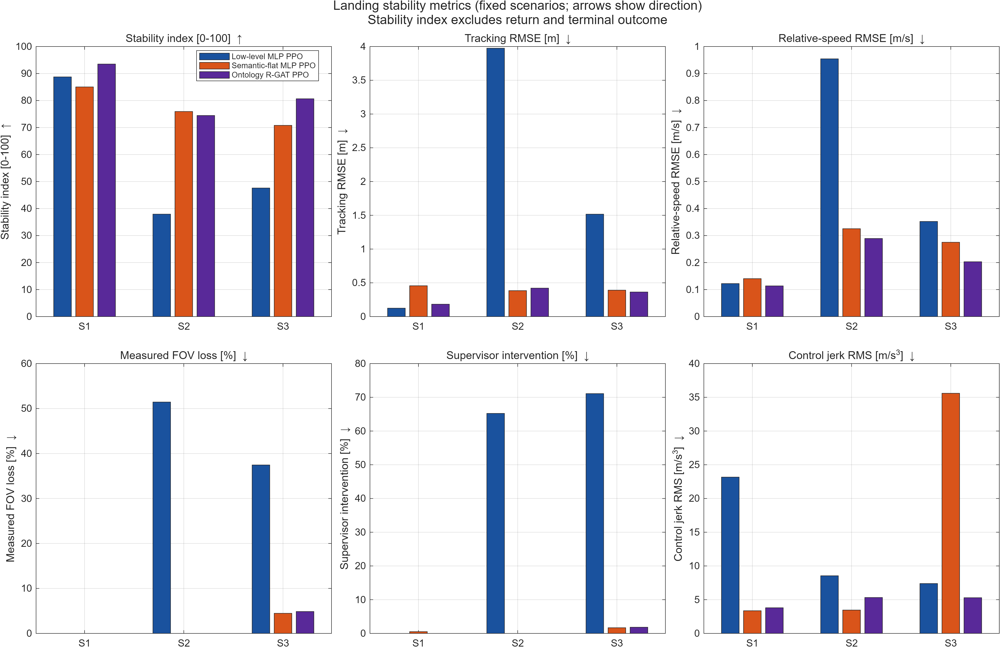
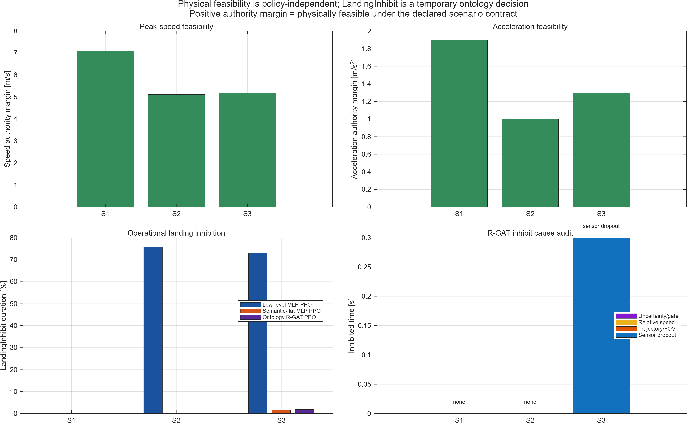
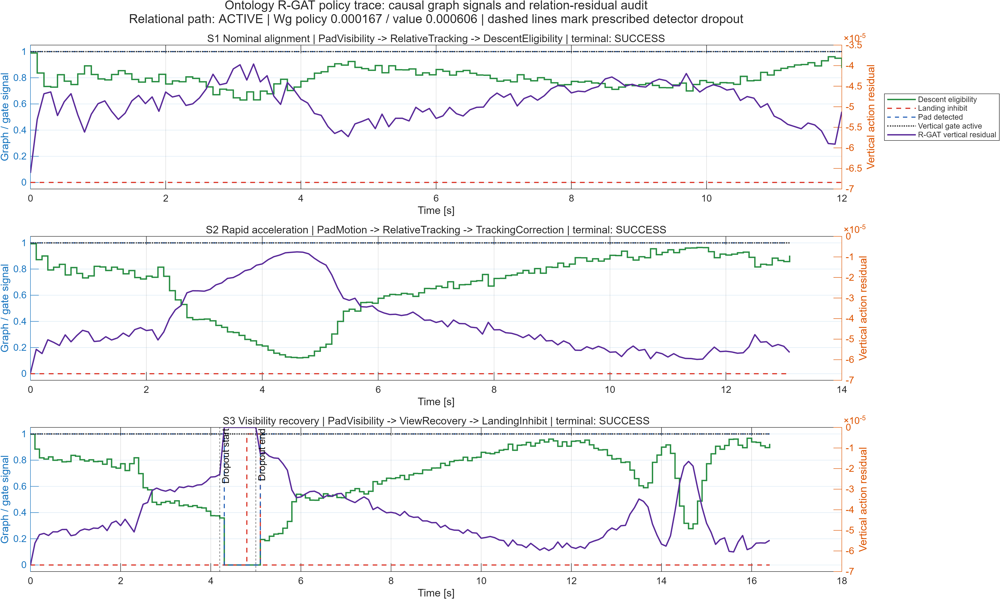

# UGV Landing 2D 최종 구현·결과 보고

## 최종 판정

- `planar_visibility_v2` 연구 파이프라인 완성
- baseline·semantic-flat·ontology R-GAT의 공통 문제 계약 확정
- 9노드·26간선 causal ontology graph 구현
- raw semantic bypass + relation residual Actor/Critic 구현
- causal masked reconstruction 사전학습 구현
- scratch PPO 2,500회 최종 checkpoint 생성
- fresh test 100 seed 평가 완료
- 논문용 고정 3시나리오·안정성·가능성 시각화 완료
- MATLAB R2025b 최종 계약 self-test 8/8 통과
- 세 모델 smoke pipeline·S3 단일 시나리오 통과
- 최신 R-GAT checkpoint relation readout 활성 확인
- 활성화 전후 test 결과율 동일 확인
- 최종 그림·CSV 갱신: 2026-10-04 14:52 KST
- 활성 R-GAT 성능 우월성 주장 제외

## 연구 질문

핵심 질문:

- 동일 sensor data에서 상태 표현 구조만 변경한 PPO의 행동 차이
- semantic feature 추가 효과와 typed relation 효과의 분리
- 가시성 손실·패드 가속 상황의 안정성 차이
- causal ontology의 실시간 추론 가능성
- hidden truth 누수 없는 graph policy 구성 가능성

## 비교군

| 모델 | 정책 입력 | 목적 |
|---|---|---|
| Low-level MLP PPO | normalized 26-field packet | 저수준 상태 기준 |
| Semantic-flat MLP PPO | flattened $12\times9$ semantic tensor | 의미 정보 효과 |
| Ontology R-GAT PPO | 동일 tensor + typed relation context | 관계 구조 효과 |

공통 조건:

- 동일 환경
- 동일 CV–CA–CV scenario distribution
- 동일 sensor·noise·dropout contract
- 동일 action $[a_x,a_z]$
- 동일 safety supervisor
- 동일 reward
- 동일 terminal rule
- 동일 PPO budget
- 모방학습 제외

## 시스템 구조



데이터 흐름:

```text
camera + own-state
→ causal observation memory
→ 26-field packet
→ baseline vector 또는 9-node ontology graph
→ Actor/Critic
→ Gaussian raw action
→ tanh·acceleration scaling
→ common safety supervisor
→ pitch/thrust dynamics
→ reward·terminal
```

## 온톨로지 설계



### 노드

| 그룹 | 노드 |
|---|---|
| Perception | `PadVisibility`, `ViewRecovery` |
| Tracking | `PadMotion`, `RelativeTracking`, `TrackingCorrection` |
| Vehicle | `DroneTranslation`, `DroneAttitude` |
| Safety | `DescentEligibility`, `LandingInhibit` |

### 관계

- `informs`
- `affects_visibility`
- `supports`
- `inhibits`
- `self`

수량:

- 의미 노드 9개
- 의미 간선 17개
- 자기 간선 9개
- 전체 간선 26개
- 고립 노드 0개

### 특징

$$
X_t\in\mathbb{R}^{12\times9}
$$

노드당 특징:

- primary·signed primary
- secondary·signed secondary
- validity·confidence·uncertainty
- trend·urgency
- remaining time
- bias·type identifier

## 강화학습 결합

R-GAT attention:

$$
e_{ij}^{(r)}=\mathrm{LeakyReLU}
\left(a_r^\top[W_rx_i\Vert W_rx_j\Vert E_r]\right)
$$

$$
h_j=\tanh\left(\sum_{(i,r)\in\mathcal N(j)}
\alpha_{ij}^{(r)}W_rx_i+W_0x_j+b_0\right)
$$

Relation context:

$$
c_t=\tanh(W_g\mathrm{GroupReadout}(H_t)+b_g)
$$

Raw bypass:

$$
s_t=\mathrm{vec}(X_t)\in\mathbb{R}^{108}
$$

Actor:

$$
\mu_t=f_\pi(s_t)+W_\pi c_t
$$

Critic:

$$
V_t=f_V(s_t)+w_V^\top c_t
$$

안전 의미 gate:

$$
\delta_{z,t}^{gate}=\begin{cases}
\delta_{z,t},&\delta_{z,t}\ge0,\\
E_t\delta_{z,t},&\delta_{z,t}<0
\end{cases}
$$

- 추가 하강 residual만 eligibility 적용
- 상승·제동 residual 유지
- `LandingInhibit` 활성 시 추가 하강 차단

## 정보 누수 방지

정책·그래프 허용 정보:

- 현재 own-state
- 현재 camera detection
- causal track estimate
- observation age
- uncertainty
- previous normalized action
- public safety state

정책·그래프 금지 정보:

- hidden current pad truth
- future trajectory
- scenario phase label
- reward·return·advantage
- terminal outcome
- teacher action

사전학습 금지 정보:

- action target
- reward target
- outcome target
- future target
- hidden truth

## 공통 보상

$$
r_t=B_t-C_t+w_r(q_t-q_{t-1})+gamma_{\Delta t}\Phi_t-\Phi_{t-1}
$$

구성:

- bounded goal cost
- camera view cost
- normalized control cost
- landing-readiness progress
- potential-difference shaping
- one-time terminal bonus

모델별 reward 변경:

- 없음

## 전체 test 결과

- 평가 split: 모델 선택과 분리된 test seed `3001:3100`
- 평가 수: 모델별 100 episode
- 추론 프로파일: 동일 호스트 500회 반복

| 모델 | 성공률 | 위험률 | 안전 중단률 | 시간 초과율 | 평균 return |
|---|---:|---:|---:|---:|---:|
| Low-level | 74% | **2%** | 23% | **1%** | **19.139** |
| Semantic-flat | **75%** | 9% | **13%** | 3% | 18.496 |
| Ontology R-GAT | 72% | 9% | 14% | 5% | 17.930 |

| 모델 | Policy 추론 | Actor/Critic 전체 |
|---|---:|---:|
| Low-level | **0.150 ms** | **0.166 ms** |
| Semantic-flat | 0.163 ms | 0.279 ms |
| Ontology R-GAT | 0.253 ms | 0.406 ms |

- 실행시간: MATLAB 소프트웨어 프로파일
- 경성 실시간 보장·WCET 판정 제외

성능 판정:

- 전체 성공률 기준 semantic-flat 최고
- 안전 접촉 기준 baseline 우수
- ontology R-GAT의 전체 우월성 부재
- 단일 학습 seed 결과
- 다중 seed 통계 검증 필요



## 대표 시나리오 결과

| 시나리오 | Low-level | Semantic-flat | R-GAT | 안정성 지수 |
|---|---|---|---|---|
| S1 정상 정렬 | 성공 | 비허가 접촉 | 성공 | 88.7 / 85.0 / **93.5** |
| S2 급가속 | 안전 중단 | 성공 | 성공 | 37.9 / **75.9** / 74.3 |
| S3 dropout | 안전 중단 | 성공 | 성공 | 47.6 / 70.8 / **80.6** |



해석:

- low-level의 S2·S3 FOV 이탈과 recovery abort
- semantic-flat과 R-GAT의 S2·S3 착륙 성공
- S1 semantic-flat 비허가 접촉
- S3 R-GAT의 semantic-flat 대비 낮은 relative-speed RMSE
- S3 R-GAT의 semantic-flat 대비 낮은 control jerk
- 단일 대표 trajectory 기반 일반화 제외

## 안정성 결과



지표 구성:

- tracking RMSE
- relative-speed RMSE
- measured FOV loss
- supervisor intervention
- pitch RMS
- control jerk RMS

종합 지수:

$$
S_{stability}=\frac{100}{6}\sum_{k=1}^{6}S_k
$$

- return 제외
- terminal outcome 제외
- 성공률 별도 보고

## 착륙 가능성 결과



S1~S3 판정:

- speed margin 양수
- acceleration margin 양수
- mission-time margin 양수
- 물리적 착륙 가능

`LandingInhibit` 해석:

- 현재 하강 금지
- 영구적 착륙 불가능 판정 제외
- sensor dropout·trajectory/FOV·relative speed·uncertainty 원인 분해

## 최종 R-GAT 구조 감사

| 항목 | Policy | Value |
|---|---:|---:|
| Graph readout norm | 0.0001665 | 0.0006056 |
| Relation head norm | 0.1517 | 0.4792 |
| Relation path | 활성 | 활성 |
| Calibration scale | 0.001 | 0.001 |



해결 구조:

- flat-equivalent anchor의 raw Actor/Critic 고정
- attention·readout·relation head 전용 PPO 25회
- 100 validation seed 결과율 비열화 가드
- relation residual norm $[10^{-6},0.005]$ 신뢰구간
- 최대 안전 스케일 자동 선택
- test seed의 선택 과정 사용 제외

연구 주장 영향:

- 온톨로지 입력 설계 구현 주장 가능
- causal R-GAT 학습 코드 구현 주장 가능
- 활성 R-GAT 계산 경로 주장 가능
- test 결과율 유지 주장 가능
- 작은 residual의 보편적 성능 우월성 주장 불가
- semantic-flat 이상의 통계적 관계 구조 효과 실증 미완료

## 검증

| 검증 | 결과 |
|---|---|
| 최종 계약 self-test | 8/8 통과 |
| 세 모델 smoke pipeline | 통과 |
| S3 단일 시나리오 | 통과 |
| checkpoint signature | 통과 |
| task fingerprint A/B/C 동일성 | 통과 |
| 고정 scenario 주입 | 통과 |
| 최소 PNG export | 통과 |
| relation performance guard | 결과율 비열화 차단 통과 |
| architecture audit | relation path 활성 탐지 |

## 최종 파일

실행:

- `run.m`
- `run_scenario.m`

핵심 구현:

- `src/orchestration/+landing2d`
- `src/simulations/+landing2d`
- `src/algorithms/+landing2d`

문서:

- `README.md`
- `README_KO.md`
- `docs/ONTOLOGY_GRAPH_STATE_KO.md`
- `docs/refactor/SYSTEM_SPEC.md`
- `docs/refactor/CONFIGURATION.md`
- `docs/refactor/REWARD_RATIONALE.md`
- `docs/VALIDATION_KO.md`
- `docs/MODULE_MAP_KO.md`

## 최종 제한

- 2D simulator 한정
- ideal own-state 사용
- 실제 ROS 2 transport 제외
- 실제 비행 안전 인증 제외
- 단일 PPO training seed 결과
- relation residual의 작은 안전 신뢰구간
- 보편적 온톨로지 우월성 주장 제외

## 다음 연구 조건

- graph selection margin·adaptation schedule의 다중 seed 재검토
- 비영 $W_g$ checkpoint 자동 감사 유지
- semantic-flat과 동일 base weight에서 relation residual만 비교
- 5개 이상 독립 학습 seed
- fresh held-out test 유지
- 성공률·위험률·안정성 지수의 평균·분산 보고
- 활성 relation scale과 residual 크기 동시 보고
