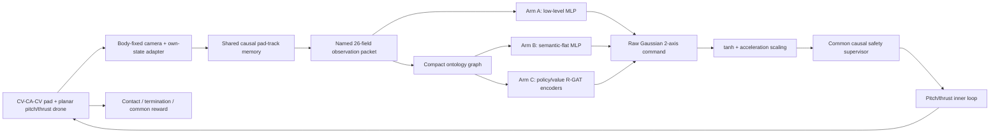

# Planar visibility PPO v2 — system specification

## Block diagram

## Coordinate and action contract

- World `x` is forward and `z` is upward. `y`, `vy`, roll, and yaw do not exist.
- Physical state: `[x,z,vx,vz,theta,pitchRate,collectiveThrust]`.
- Positive `theta` tilts thrust toward `+x`.
- PPO samples `u_raw` from a diagonal Gaussian. `a_norm=tanh(u_raw)`.
- The two requested commands are `[axMax*a_norm(1), azMax*a_norm(2)]`.
- PPO likelihoods always refer to stored `u_raw`, never supervisor-modified acceleration.

The inner-loop targets and actual translational dynamics are

$$
\theta_{sp}=\operatorname{atan2}(a_x,g+a_z),\qquad
T_{sp}=m\sqrt{a_x^2+(g+a_z)^2},
$$

$$
\ddot x=\frac{T\sin\theta}{m},\qquad
\ddot z=\frac{T\cos\theta}{m}-g.
$$

Actual pitch follows a damped second-order response and thrust a first-order
response. The old net-acceleration double integrator is available only through
the explicit legacy experiment.

## Camera geometry

For `d=[ex,-h]`, body-fixed optical axis
`b_cam=[-sin(theta),-cos(theta)]`, and image-right axis
`b_right=[cos(theta),-sin(theta)]`:

$$
d_{cam}=d^T b_{cam},\quad \ell=d^T b_{right},\quad
\beta=\operatorname{atan2}(\ell,d_{cam}).
$$

A detection requires positive depth, valid range, and
`abs(beta)<FOV/2`. At zero pitch this reduces to
`abs(ex)<h*tan(FOV/2)`.

## Episode boundary

Each action is held over 0.1 s while physics advances at 0.01 s, unless the
earliest terminal event occurs first. Contact interpolation preserves pre-impact
relative velocity, position, pitch, and rate. All named task outcomes terminate
and use zero bootstrap; only an external rollout-collection boundary truncates.

The safety supervisor is identical across A/B/C and sees only own state plus the
causal packet. It can brake/hold or complete a latched abort, but it cannot read
the current hidden pad state or relabel an actual collision as safe.
